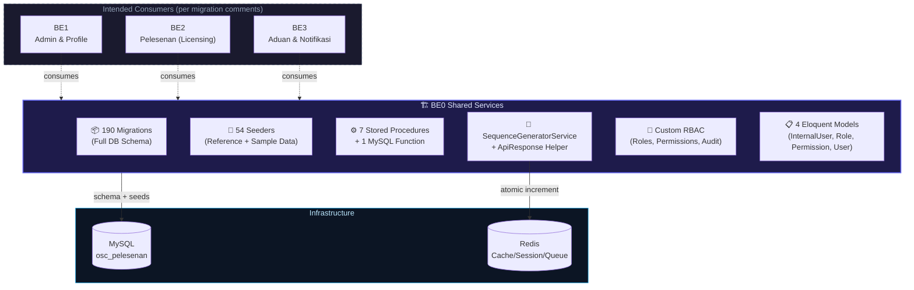
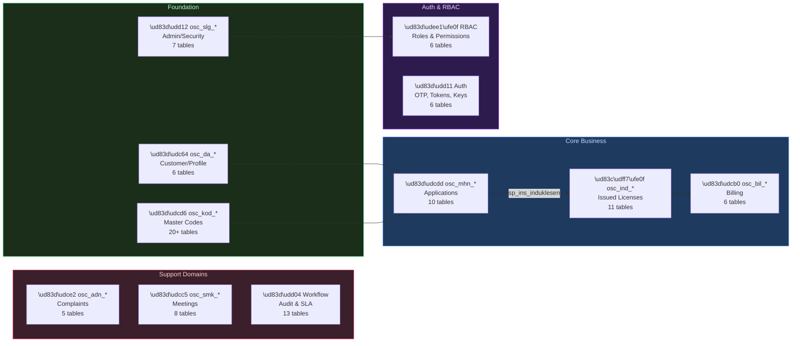
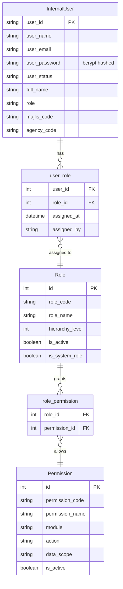
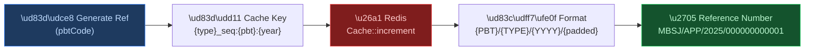
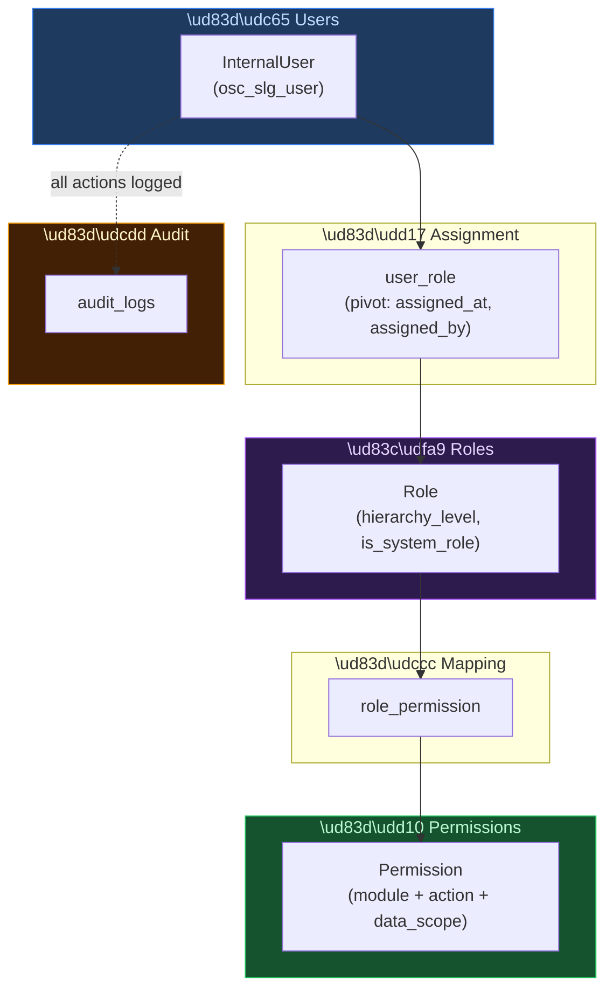
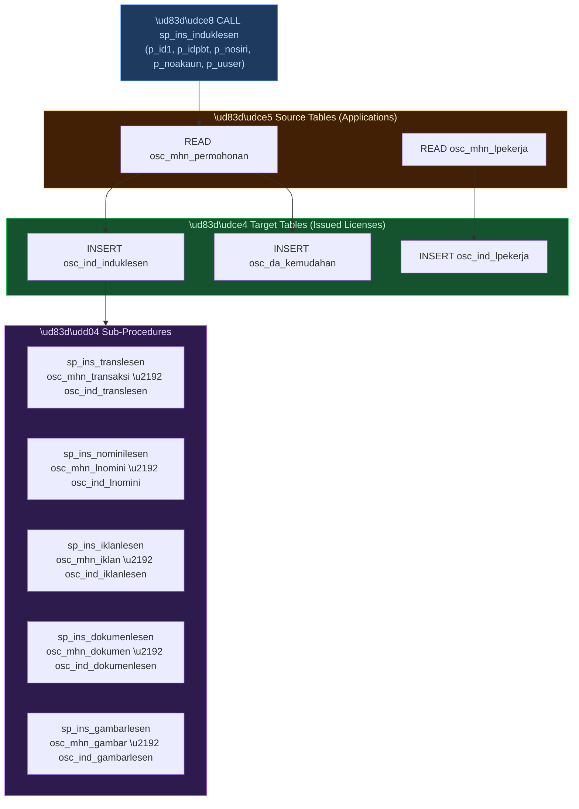
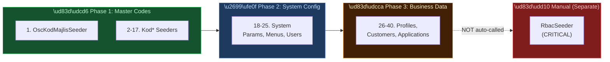
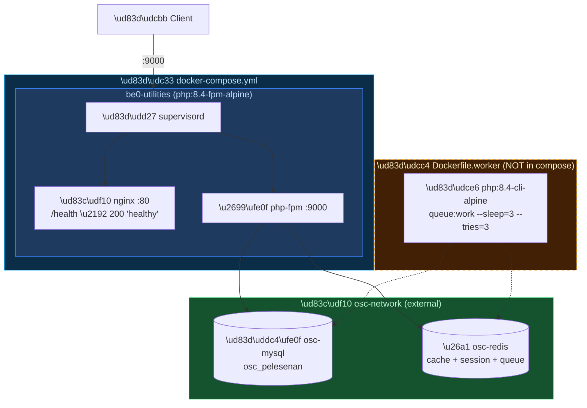
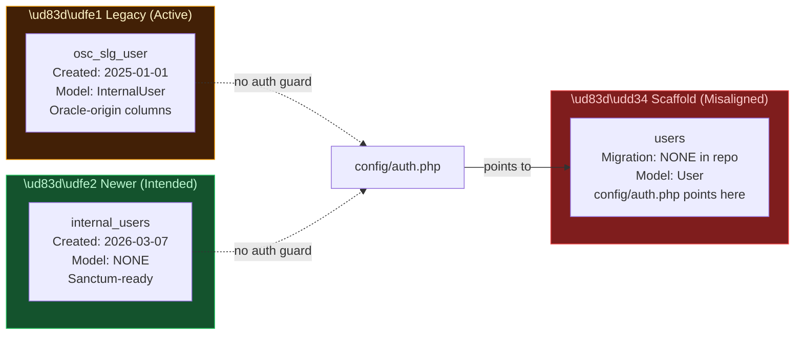

import { Tabs, Tab } from 'fumadocs-ui/components/tabs';

# BE0 Shared Services (OSC-BE0-UTILITI)

## 1. Overview

<div className="grid grid-cols-2 md:grid-cols-3 gap-3 my-6">
  <div className="bg-gradient-to-br from-blue-950 to-blue-900 border border-blue-700/50 rounded-lg p-4 text-center">
    <div className="text-3xl font-bold text-blue-300">190</div>
    <div className="text-xs text-blue-400 mt-1">Migrations</div>
  </div>
  <div className="bg-gradient-to-br from-emerald-950 to-emerald-900 border border-emerald-700/50 rounded-lg p-4 text-center">
    <div className="text-3xl font-bold text-emerald-300">54</div>
    <div className="text-xs text-emerald-400 mt-1">Seeders</div>
  </div>
  <div className="bg-gradient-to-br from-violet-950 to-violet-900 border border-violet-700/50 rounded-lg p-4 text-center">
    <div className="text-3xl font-bold text-violet-300">7+1</div>
    <div className="text-xs text-violet-400 mt-1">Stored Procs & Functions</div>
  </div>
  <div className="bg-gradient-to-br from-amber-950 to-amber-900 border border-amber-700/50 rounded-lg p-4 text-center">
    <div className="text-3xl font-bold text-amber-300">4</div>
    <div className="text-xs text-amber-400 mt-1">Eloquent Models</div>
  </div>
  <div className="bg-gradient-to-br from-rose-950 to-rose-900 border border-rose-700/50 rounded-lg p-4 text-center">
    <div className="text-3xl font-bold text-rose-300">0</div>
    <div className="text-xs text-rose-400 mt-1">API Routes</div>
  </div>
  <div className="bg-gradient-to-br from-cyan-950 to-cyan-900 border border-cyan-700/50 rounded-lg p-4 text-center">
    <div className="text-3xl font-bold text-cyan-300">0</div>
    <div className="text-xs text-cyan-400 mt-1">Middleware</div>
  </div>
</div>

**Repository**: osc-be0-utiliti-main  
**Name**: BE0 Shared Services  
**Purpose**: Shared utility and schema foundation backend for the OSC Pelesenan (Licensing) system  
**Framework**: Laravel 12 on PHP 8.2+  
**Database**: MySQL with Redis cache/session/queue layer  
**Status**: Database-heavy, HTTP-thin  

### System Role

BE0 is **not** a standalone service—it is the shared foundation that BE1, BE2, and BE3 (sibling backends) depend upon. The repository contains:

- **Database schema**: 191 migrations defining system-wide tables for customers, licensing, billing, complaints, meetings, RBAC, and audit trails
- **Reference data**: 54 seeders that populate master codes, user groups, system parameters, and realistic sample data
- **Stored procedures**: MySQL procedures that automate the conversion of approved applications into issued licenses
- **Shared services**: `SequenceGeneratorService` for reference number generation, `ApiResponse` helper for standardized JSON responses
- **Custom RBAC**: Role-based access control via `roles`, `permissions`, `user_role`, and `role_permission` tables



:::warning
Dashed lines to BE1/BE2/BE3 indicate **intended** consumption per migration comments — not verified runtime consumption within this repo.
:::

### Key Architectural Reality

:::danger
**The HTTP surface is EMPTY.** The only verified HTTP route is `GET /` (returns the default Laravel welcome view). There are no API routes, no API controllers, no middleware, and no form requests. **The database layer is the primary source of truth** — the HTTP surface exists only as a skeleton.
:::

### Oracle Origins

:::info
The schema originated from an Oracle `OSCL` database (evidenced by `database/OSCL DDL 3Dec2025.txt` containing Oracle DDL with `VARCHAR2` types). Migration `2026_02_25_000001_align_oracle_mysql_schema.php` performed the Oracle-to-MySQL schema alignment. Legacy column naming conventions (abbreviated Malay) persist from this origin.
:::

---

## 2. Tech Stack

<Tabs items={['PHP / Composer', 'Node / NPM', 'Scripts', 'Notable Omissions']}>
  <Tab value="PHP / Composer">

**Production**
| Package | Version |
|---------|--------|
| `php` | ^8.2 |
| `laravel/framework` | ^12.0 |
| `laravel/tinker` | ^2.10.1 |

**Dev**
| Package | Version |
|---------|--------|
| `fakerphp/faker` | ^1.23 |
| `laravel/pail` | ^1.2.2 |
| `laravel/pint` | ^1.24 |
| `laravel/sail` | ^1.41 |
| `mockery/mockery` | ^1.6 |
| `nunomaduro/collision` | ^8.6 |
| `phpunit/phpunit` | ^11.5.3 |

  </Tab>
  <Tab value="Node / NPM">

| Package | Version |
|---------|--------|
| `@tailwindcss/vite` | ^4.0.0 |
| `axios` | ^1.11.0 |
| `concurrently` | ^9.0.1 |
| `laravel-vite-plugin` | ^2.0.0 |
| `tailwindcss` | ^4.0.0 |
| `vite` | ^7.0.7 |

  </Tab>
  <Tab value="Scripts">

**Composer**
```bash
# Full setup (install, key, migrate, build)
composer setup

# Dev mode (serve + queue + pail + vite)
composer dev

# Run tests
composer test
```

**NPM**
```bash
npm run build   # vite build
npm run dev     # vite dev server
```

  </Tab>
  <Tab value="Notable Omissions">

:::warning
**No `laravel/sanctum`** in composer.json, despite migration comments and the `internal_users` table suggesting Sanctum-style auth across BE1/BE2/BE3.
:::

:::info
**No `spatie/laravel-permission`** — RBAC is entirely custom-built with hand-rolled models and pivot tables.
:::

  </Tab>
</Tabs>

---

## 3. Getting Started

<Tabs items={['Docker (Recommended)', 'Local (Without Docker)']}>
  <Tab value="Docker (Recommended)">

```bash
# Start MySQL, Redis, and Laravel container
docker-compose up -d

# Run migrations
docker-compose exec be0-utilities php artisan migrate

# Seed reference data (master codes, system parameters, menus)
docker-compose exec be0-utilities php artisan db:seed --class=DatabaseSeeder

# Seed RBAC separately (NOT called by DatabaseSeeder)
docker-compose exec be0-utilities php artisan db:seed --class=RbacSeeder

# Run tests
docker-compose exec be0-utilities php artisan test
```

  </Tab>
  <Tab value="Local (Without Docker)">

```bash
composer setup
php artisan migrate
php artisan db:seed --class=DatabaseSeeder
php artisan db:seed --class=RbacSeeder
npm run dev
```

  </Tab>
</Tabs>

:::danger
**Do not forget `RbacSeeder`!** The default `DatabaseSeeder` does NOT include RBAC. Without running `RbacSeeder` separately, your system will have **zero roles and zero permissions**.
:::

### Environment Setup

Copy `.env.example` to `.env` and update:

```bash
APP_NAME="BE0 Shared Services"
APP_TIMEZONE=Asia/Kuala_Lumpur
DB_DATABASE=osc_pelesenan
DB_USERNAME=root
DB_PASSWORD=secret
BCRYPT_ROUNDS=12
CACHE_STORE=redis
SESSION_DRIVER=redis
QUEUE_CONNECTION=redis
```

### Local Development (With Docker Compose)

See the **Docker (Recommended)** tab above.

### Local Development (Without Docker)

See the **Local (Without Docker)** tab above.

### Key Configuration Files

| File | Purpose |
|------|---------|
| `config/auth.php` | Authentication driver (currently points to scaffold `App\Models\User`, NOT the active domain models) |
| `config/database.php` | Database connections (mysql, mariadb, sqlite, pgsql) |
| `config/cache.php` | Cache store (default: database, can override to redis) |
| `config/session.php` | Session driver (default: database, can override to redis) |
| `config/queue.php` | Queue connection (default: database, can override to redis) |
| `config/mail.php` | Email configuration (default: log driver) |

---

## 4. Database Schema

### Schema Organization

The database is organized into 19 domains, each serving distinct business functions.



#### Framework Tables (Laravel Runtime)
- `cache` — Cache table
- `jobs`, `job_batches`, `failed_jobs` — Queue records
- `sessions` — Session storage
- `personal_access_tokens` — API token storage (unused in this repo)

#### Customer & Profile (osc_da_*)
| Table | Purpose |
|-------|--------|
| `osc_da_pelanggan` | Customer master records |
| `osc_da_alamat` | Customer addresses |
| `osc_da_individu` | Individual profiles (IC, name, contact) |
| `osc_da_syarikat` | Company profiles (SSM verification, verification_status) |
| `osc_da_kemudahan` | Facilities |
| `osc_da_listhitam` | Blacklist records |

#### Internal Admin & Security (osc_slg_*)
| Table | Purpose |
|-------|--------|
| `osc_slg_user` | Internal staff users (mapped by InternalUser model) |
| `osc_slg_usergrp` | User groups |
| `osc_slg_menu` | Menu definitions |
| `osc_slg_menuctrl` | Menu access controls |
| `osc_slg_menugrp` | Menu groups |
| `osc_slg_sysparam` | System parameters |
| `osc_slg_lookuptable` | Lookup/control code values (used by `get_value_lookup_table` function) |

#### Master Codes (osc_kod_*)
| Table | Purpose |
|-------|--------|
| `osc_kod_majlis` | Local Authority (PBT) codes — **must be seeded first** |
| `osc_kod_agensi` | Agency codes |
| `osc_kod_undang` | Law/regulation codes |
| `osc_kod_jenis` | Type/kind codes |
| `osc_kod_sektor` | Sector codes |
| `osc_kod_aktiviti` | Activity codes |
| `osc_kod_niaga` / `osc_kod_niaga1` | Trade/commerce codes |
| `osc_kod_dokumen` | Document type codes |
| `osc_kod_image` | Image type codes |
| `osc_kod_aktakompaun` | Compound act codes |
| `osc_kod_jenisaduan` | Complaint type codes |
| `osc_kod_kesalahan` | Offence codes |
| `osc_kod_listhitam` | Blacklist reason codes |
| `osc_kod_lokasi` | Location codes |
| `osc_kod_poskod` | Postal codes |
| `osc_kod_ptjpk` | Office/department codes |
| `osc_kod_tranlesen` | License transaction codes |
| `osc_kod_aktvtagensi` | Agency activity codes |
| `osc_kod_aktivtdokumen` | Document activity codes |

#### License Applications (osc_mhn_*)

| Table | Purpose |
|-------|--------|
| `osc_mhn_permohonan` | Application master records |
| `osc_mhn_transaksi` | Application transactions |
| `osc_mhn_dokumen` | Application documents |
| `osc_mhn_gambar` | Application images |
| `osc_mhn_iklan` | Application advertisements |
| `osc_mhn_ulasan` | Application reviews |
| `osc_mhn_ulasandetail` | Review details |
| `osc_mhn_lnomini` | Application nominees |
| `osc_mhn_lpekerja` | Application workers |
| `osc_mhn_timeline` | Application timeline events |

Core domain: licensing applications from customer to final approval.

#### Issued Licenses (osc_ind_*)

| Table | Purpose |
|-------|--------|
| `osc_ind_induklesen` | Issued license master records |
| `osc_ind_translesen` | License transactions |
| `osc_ind_dokumenlesen` | License documents |
| `osc_ind_gambarlesen` | License images |
| `osc_ind_iklanlesen` | License advertisements |
| `osc_ind_ulasanlesen` | License reviews |
| `osc_ind_ulasandetail` | License review details |
| `osc_ind_kompaun` | Compound records |
| `osc_ind_lnomini` | License nominees |
| `osc_ind_lpekerja` | License workers |
| `osc_ind_transbatal` | License cancellation transactions |

**Data Flow**: Approved applications (`osc_mhn_*`) are converted to issued licenses (`osc_ind_*`) via stored procedures.

#### Billing (osc_bil_*)
| Table | Purpose |
|-------|--------|
| `osc_bil_tmphlesen` | License billing records |
| `osc_bil_translesen` | Billing transactions |
| `osc_bil_mesejbil` | Billing messages |
| `osc_bil_pelbagai` | Miscellaneous billing |
| `osc_bil_bayaran` | Payments |
| `osc_bil_versi` | Bill versions |

#### Complaints (osc_adn_*)
| Table | Purpose |
|-------|--------|
| `osc_adn_indaduan` | Complaint master records |
| `osc_adn_agihan` | Complaint assignments |
| `osc_adn_gbraduan` | Complaint images |
| `osc_adn_csat` | Customer satisfaction surveys |
| `osc_adn_log` | Complaint activity logs |

#### Meetings (osc_smk_* + meeting_*)
| Table | Purpose |
|-------|--------|
| `osc_smk_mesyuarat` | Meeting master records |
| `osc_smk_accmesyuarat` | Meeting accounts |
| `osc_smk_semakan` | Meeting checks/verifications |
| `meeting_agendas` | Meeting agendas |
| `meeting_agenda_items` | Agenda items |
| `meeting_attendees` | Meeting attendees |
| `meeting_decisions` | Meeting decisions |
| `meeting_minutes` | Meeting minutes |

#### RBAC Tables (Custom, No Spatie Package)

| Table | Purpose |
|-------|---------|
| `roles` | Role definition with hierarchy |
| `permissions` | Permission definition (module + action + data_scope) |
| `user_role` | User-role assignment (pivot: assigned_at, assigned_by) |
| `role_permission` | Role-permission assignment |
| `account_role` | Account-role assignments |
| `audit_logs` | Compliance audit trail |

#### Auth & Security Tables
| Table | Purpose |
|-------|--------|
| `internal_users` | Officer authentication (created 2026-03-07, Sanctum-ready, **no model in this repo**) |
| `otp_verifications` | OTP verification records |
| `personal_access_tokens` | API token storage |
| `password_history` | Password change history |
| `password_reset_tokens` | Password reset tokens |
| `api_keys` | API key management |

#### Audit & Workflow Tables
| Table | Purpose |
|-------|--------|
| `audit_logs` | Compliance audit trail |
| `parameter_history` | Parameter change history |
| `status_histories` | Status change tracking |
| `application_processing_logs` | Application processing audit |
| `recommendations` | Workflow recommendations |
| `checklist_items` | Workflow checklists |
| `site_visits` | Site visit records (with monitoring fields) |
| `queries` | Query records |
| `sla_alerts` | SLA alert tracking |
| `bill_reminders` | Bill reminder scheduling |
| `renewals` | License renewal records |
| `syor_keputusan` | Decision recommendations |
| `syor_attachments` | Decision attachments |

#### Other Tables
| Table | Purpose |
|-------|--------|
| `osc_cgr_cagaran` | Guarantee/deposit records |
| `osc_ktp_transaksi` | Counter transactions |
| `osc_pyt_penyata` | Financial statements |
| `osc_hst_penyata` | Historical statements |
| `osc_trn_online` | Online transactions |
| `osc_pne_personelia` | Personnel records |
| `osc_pbh_permohonan` | PBH applications |
| `osc_usr_profile` | User profiles (external) |
| `osc_email_templates` | Email templates |
| `documents` | Generic document records |
| `notifications` | Notification records |
| `qr_codes` | QR code records |
| `license_types` / `license_type_versions` | License type definitions |
| `license_verification_logs` | License verification audit |

---

## 5. Core Models

### Model Relationship Diagram



### App\Models\InternalUser

**Table**: `osc_slg_user` (explicit)  
**Purpose**: Active domain model for internal staff users

**Fillable**: user_id, user_group_id, user_name, user_email, user_password, user_status, user_created, user_pelangganid, user_iuser, user_uuser, force_password_reset, full_name, role, majlis_code, majlis_id, agency_code

**Hidden**: user_password

**Custom Mutator**: `setUserPasswordAttribute()` — auto-hashes password using bcrypt. Checks for `$2y$` prefix and length 60 to avoid double-hashing.

**Relationships**:
- `roles()` → `belongsToMany(Role::class, 'user_role', 'user_id', 'role_id')` with pivot: `assigned_at`, `assigned_by`

### App\Models\Role

**Table**: `roles` (implicit)  
**Fillable**: role_code, role_name, hierarchy_level, description, is_active, is_system_role  
**Casts**: hierarchy_level (integer), is_active (boolean), is_system_role (boolean)

**Relationships**:
- `permissions()` → `belongsToMany(Permission::class, 'role_permission')`

### App\Models\Permission

**Table**: `permissions` (implicit)  
**Fillable**: permission_code, permission_name, module, action, data_scope, description, is_active  
**Casts**: is_active (boolean)

**Relationships**:
- `roles()` → `belongsToMany(Role::class, 'role_permission')`

### App\Models\User

**Table**: `users` (implicit)  
**Purpose**: Default Laravel scaffold — **NOT used anywhere in custom code**  
**Fillable**: name, email, password  
**Hidden**: password, remember_token  
**Traits**: HasFactory, Notifiable  
**Note**: `config/auth.php` points to this model via `env('AUTH_MODEL', App\Models\User::class)`, but no domain code references it.

:::tip
Only `InternalUser`, `Role`, and `Permission` are domain models. The `User` model is unused scaffold from Laravel's default installation.
:::

---

## 6. Shared Services

### SequenceGeneratorService

**Purpose**: Generate formatted reference numbers using Redis atomic increment



| Method | Format | Example |
|--------|--------|---------|
| `generateApplicationRef(pbtCode)` | `{PBT}/APP/{YYYY}/{12-digit}` | `MBSJ/APP/2025/000000000001` |
| `generateBillNumber(pbtCode)` | `{PBT}/BIL/{YYYY}/{12-digit}` | `MBSJ/BIL/2025/000000000001` |
| `generateLicenseNumber(pbtCode, licenseTypeCode)` | `{PBT}/{TYPE}/{YYYY}/{12-digit}` | `MBSJ/FOOD/2025/000000000001` |
| `generateMeetingNumber(pbtCode)` | `{PBT}/MSY/{YYYY}/{10-digit}` | `MBSJ/MSY/2025/0000000001` |
| `generateComplaintRef(pbtCode)` | `{PBT}/ADN/{YY}/{4-digit}` | `MBSJ/ADN/26/0001` |

### ApiResponse Helper

**Methods**:
- `ApiResponse::success(data, message="Success", code=200)` → Returns standardized JSON response
- `ApiResponse::error(message="Error", code=400, errors=[])` → Returns error JSON

:::warning
**Zero call sites.** `ApiResponse` is defined but never imported or called anywhere in this repo. It appears designed for consumption by sibling backends (BE1/BE2/BE3).
:::

---

## 7. Custom RBAC System



### Tables

- `roles` — Role definitions with hierarchy
- `permissions` — Atomic permissions grouped by module + action
- `user_role` — User-role assignments
- `role_permission` — Role-permission mappings
- `audit_logs` — Compliance audit trail

### Key Modules

customers, addresses, documents, users, profiles, roles, permissions, applications, meetings, monitoring, comments, recommendations, reports, complaints, cancellations, certificates, master_data, email_templates, notifications, audit_logs, system

### Seeding RBAC

```bash
php artisan db:seed --class=RbacSeeder
```

**Critical Note**: if you seed BE0 without running `RbacSeeder`, your system will have zero roles/permissions.

:::info
**RBAC Modules**: customers, addresses, documents, users, profiles, roles, permissions, applications, meetings, monitoring, comments, recommendations, reports, complaints, cancellations, certificates, master_data, email_templates, notifications, audit_logs, system
:::

---

## 8. Stored Procedures & MySQL Functions

### Execution Flow



### Stored Procedures

All procedures follow signature: `CALL sp_xxx(p_id1, p_idpbt, p_nosiri, p_noakaun, p_uuser)`

| Procedure | Source | Target | Purpose |
|-----------|--------|--------|---------|
| `sp_ins_induklesen` | `osc_mhn_permohonan` + `osc_mhn_lpekerja` | `osc_ind_induklesen` + `osc_ind_lpekerja` + `osc_da_kemudahan` | Master procedure: convert application to license, copy workers, create facility |
| `sp_ins_translesen` | `osc_mhn_transaksi` | `osc_ind_translesen` | Copy transactions |
| `sp_ins_nominilesen` | `osc_mhn_lnomini` | `osc_ind_lnomini` | Copy nominees |
| `sp_ins_iklanlesen` | `osc_mhn_iklan` | `osc_ind_iklanlesen` | Copy advertisements |
| `sp_ins_gambarlesen` | `osc_mhn_gambar` | `osc_ind_gambarlesen` | Copy images |
| `sp_ins_dokumenlesen` | `osc_mhn_dokumen` | `osc_ind_dokumenlesen` | Copy documents |
| `ins_kodniaga_baru` | `osc_kod_niaga` (self) | `osc_kod_niaga` | Generate new trade codes |

**Execution flow**: `sp_ins_induklesen` is the master procedure. It reads from `osc_mhn_permohonan`, inserts into `osc_ind_induklesen`, then calls all sub-procedures (`sp_ins_translesen`, `sp_ins_iklanlesen`, `sp_ins_nominilesen`, `sp_ins_dokumenlesen`, `sp_ins_gambarlesen`) to copy associated records.

### MySQL Functions

| Function | Parameters | Returns | Purpose |
|----------|-----------|---------|--------|
| `get_value_lookup_table` | `idpbt`, `jenis`, `rujuk` | `VARCHAR(2000)` | Lookup control code values from `osc_slg_lookuptable` |

**Known Issue**: `get_no_akaun` function is `DROP`ped in every SP migration but never `CREATE`d — orphaned reference.

:::info
**Other Procedures**: `ins_kodniaga_baru` generates new trade codes in `osc_kod_niaga` (self-referencing). This is independent from the license issuance flow.
:::

### Migration History

Stored procedures have been iteratively fixed across 5 migrations:
1. `2026_02_16_000001_create_stored_procedures.php` — Initial creation
2. `2026_02_25_000002_fix_stored_procedures_oracle_alignment.php` — Oracle-MySQL column alignment
3. `2026_03_10_000001_create_get_value_lookup_table_function.php` — Lookup function
4. `2026_03_11_041552_fix_stored_procedures_remove_id_insert.php` — Remove explicit ID inserts
5. `2026_03_12_113108_fix_sp_translesen_column_references.php` — Fix column references

---

## 9. Seeders

### Seeding Strategy



**DatabaseSeeder** orchestrates **40 seeders** in strict order:

<Tabs items={['Master Codes (1-17)', 'System Config (18-25)', 'Business Data (26-40)', 'Excluded Seeders (12)']}>
  <Tab value="Master Codes (1-17)">

| # | Seeder | Domain |
|---|--------|-------|
| 1 | OscKodMajlisSeeder | Master: PBT codes (**must be first**) |
| 2 | OscKodAgensiSeeder | Master: agency codes |
| 3 | OscKodAktakompaunSeeder | Master: compound act codes |
| 4 | OscKodJenisSeeder | Master: type codes |
| 5 | OscKodSektorSeeder | Master: sector codes |
| 6 | OscKodAktivitiSeeder | Master: activity codes |
| 7 | OscKodDokumenSeeder | Master: document type codes |
| 8 | OscKodImageSeeder | Master: image type codes |
| 9 | OscKodJenisaduanSeeder | Master: complaint type codes |
| 10 | OscKodUndangSeeder | Master: law/regulation codes |
| 11 | OscKodKesalahanSeeder | Master: offence codes |
| 12 | OscKodListhitamSeeder | Master: blacklist reason codes |
| 13 | OscKodLokasiSeeder | Master: location codes |
| 14 | OscKodNiagaSeeder | Master: trade codes |
| 15 | OscKodPoskodSeeder | Master: postal codes |
| 16 | OscKodPtjpkSeeder | Master: office/department codes |
| 17 | OscKodTranlesenSeeder | Master: license transaction codes |

  </Tab>
  <Tab value="System Config (18-25)">

| # | Seeder | Domain |
|---|--------|-------|
| 18 | SystemParameterSeeder | System: parameters |
| 19 | MenuGroupSeeder | System: menu groups |
| 20 | UserGroupSeeder | System: user groups |
| 21 | ControlCodeSeeder | System: control codes |
| 22 | ApplicationStatusSeeder | System: application statuses |
| 23 | MenuSeeder | System: menus |
| 24 | UserSeeder | System: users |
| 25 | MenuControlSeeder | System: menu controls |

  </Tab>
  <Tab value="Business Data (26-40)">

| # | Seeder | Domain |
|---|--------|-------|
| 26 | PersoneliaKakitanganSeeder | Data: personnel |
| 27 | IndukLPekerjaSeeder | Data: license workers |
| 28 | CompanyProfileSeeder | Data: company profiles |
| 29 | IklanPelesenanSeeder | Data: licensing advertisements |
| 30 | FacilitySeeder | Data: facilities |
| 31 | IndukLNominiSeeder | Data: license nominees |
| 32 | CustomerSeeder | Data: customers (~525k lines) |
| 33 | AddressSeeder | Data: addresses (~949k lines) |
| 34 | IndukLesenSeeder | Data: issued licenses |
| 35 | LicensingTransactionSeeder | Data: licensing transactions |
| 36 | IndividualProfileSeeder | Data: individual profiles |
| 37 | SyorKeputusanSeeder | Data: decision recommendations |
| 38 | CustomerUserSeeder | Data: customer users |
| 39 | RealisticApplicationSeeder | Data: sample applications |
| 40 | RenewalSampleDataSeeder | Data: renewal samples |

:::warning
`CustomerSeeder` (~525k lines) and `AddressSeeder` (~949k lines) are bulk data seeders. `RealisticApplicationSeeder` and `RenewalSampleDataSeeder` are **destructive** — they may truncate existing data.
:::

  </Tab>
  <Tab value="Excluded Seeders (12)">

These 12 seeder files exist but are **excluded** from DatabaseSeeder:

| Seeder | Purpose |
|--------|--------|
| ApplicationSeeder | Alternative application seeding |
| RbacSeeder | **CRITICAL** for authorization — must be run separately |
| RolesAndPermissionsSeeder | Alternative RBAC seeding |
| InternalUserSeeder | Alternative user seeding |
| InternalUserRoleBackfillSeeder | Backfill user-role assignments |
| DemoDataSeeder | Demo/legacy data |
| DemoData900101010001Seeder | Specific demo data scenario |
| PatilSeeder | Unknown purpose |
| LookupTmpohKadarIklnSeeder | Lookup table data |
| IndTranslesenSeeder | License transaction data |
| SyorAttachmentsSeeder | Decision attachments |
| SLMBSATransactionSeeder | SLMBSA transaction data |

:::danger
**RbacSeeder is CRITICAL** — must be run separately via `php artisan db:seed --class=RbacSeeder`
:::

  </Tab>
</Tabs>

### Critical Notes

1. Default seed does NOT include RBAC — run `RbacSeeder` separately
2. `RealisticApplicationSeeder` and `RenewalSampleDataSeeder` are destructive
3. Bulk data seeders: `CustomerSeeder` (~525k lines), `AddressSeeder` (~949k lines)
4. `OscKodMajlisSeeder` must run first (PBT codes referenced by others)

---

## 10. Testing

### Configuration

**PHPUnit 11.5.3+** with test database `osc_pelesenan_test`

### Test Coverage Overview

<div className="grid grid-cols-1 md:grid-cols-3 gap-3 my-6">
  <div className="bg-gradient-to-br from-emerald-950 to-emerald-900 border border-emerald-600/50 rounded-lg p-4">
    <div className="text-sm font-semibold text-emerald-300 mb-2">✅ Covered</div>
    <div className="text-emerald-400 text-sm">SequenceGeneratorService (6 tests: format validation, incrementing, PBT isolation)</div>
  </div>
  <div className="bg-gradient-to-br from-amber-950 to-amber-900 border border-amber-600/50 rounded-lg p-4">
    <div className="text-sm font-semibold text-amber-300 mb-2">⚠️ Scaffold Only</div>
    <div className="text-amber-400 text-sm">GET / returns 200, assertTrue(true)</div>
  </div>
  <div className="bg-gradient-to-br from-rose-950 to-rose-900 border border-rose-600/50 rounded-lg p-4">
    <div className="text-sm font-semibold text-rose-300 mb-2">❌ Zero Coverage</div>
    <div className="text-rose-400 text-sm">Auth, RBAC, workflow, meetings, complaints, renewals, billing, seeders, models</div>
  </div>
</div>

### Existing Tests

| File | Tests | Category |
|------|-------|----------|
| `tests/Feature/ExampleTest.php` | GET / returns 200 | Scaffold |
| `tests/Unit/ExampleTest.php` | `assertTrue(true)` | Scaffold |
| `tests/Unit/Services/SequenceGeneratorServiceTest.php` | 6 tests: format validation for all 5 generator methods, sequence incrementing, PBT isolation | **Meaningful** |

**Base TestCase**: Uses `DatabaseTransactions` trait (wraps each test in a transaction, rolled back on completion).

### Coverage Gaps

Zero coverage for: authentication, RBAC, workflow, meetings, complaints, renewals, billing, seeder integrity

---

## 11. Docker & Deployment

### Container Architecture



:::warning
`Dockerfile.worker` exists as a separate build target but is **NOT defined as a service in `docker-compose.yml`**. It must be deployed separately.
:::

- **App Container** (`be0-utilities`, web/FPM) — HTTP requests, supervisord runs nginx + php-fpm
- **Worker Container** (`Dockerfile.worker`, CLI) — Background job processing via `queue:work --sleep=3 --tries=3`

**Note**: `Dockerfile.worker` exists as a separate build target but is **NOT defined as a service in `docker-compose.yml`**. It must be deployed separately.

### App Container

**Base**: `php:8.4-fpm-alpine`  
**PHP Extensions**: pdo, pdo_mysql, mysqli, gd, zip, bcmath, intl, opcache, pcntl, redis (PECL)  
**Exposed Port**: `9000` (PHP-FPM socket)  
**Entrypoint**: `/usr/bin/supervisord` (runs nginx on port 80 + php-fpm on port 9000)  
**PHP Config**: memory_limit=256M, max_execution_time=300, upload_max_filesize=100M, expose_php=Off  
**OPcache**: enabled, 256MB memory, validate_timestamps=0  
**Health Check**: `curl http://localhost/health` (30s interval, 60s start, 3 retries) — handled by nginx directly (`return 200 "healthy\n"`, does NOT hit PHP)

### Worker Container

**Base**: `php:8.4-cli-alpine`  
**CMD**: `php artisan queue:work --sleep=3 --tries=3`  
**Status**: Dockerfile exists but not referenced in docker-compose.yml

### Docker Compose

**Service**: `be0-utilities`

<Tabs items={['Environment', 'Ports & Volumes', 'PHP Config']}>
  <Tab value="Environment">

```bash
APP_TIMEZONE=Asia/Kuala_Lumpur
DB_HOST=osc-mysql          # external service
REDIS_HOST=osc-redis        # external service
CACHE_STORE=redis           # overrides .env default of "database"
SESSION_DRIVER=redis        # overrides .env default of "database"
QUEUE_CONNECTION=redis      # overrides .env default of "database"
CACHE_PREFIX=be0_
```

  </Tab>
  <Tab value="Ports & Volumes">

| Setting | Value |
|---------|------|
| Port Mapping | `9000:9000` (PHP-FPM socket) |
| Volumes | `./storage:/var/www/storage` |
| Networks | `osc-network` (external, shared with BE1/BE2/BE3/MySQL/Redis) |
| Health Check | `curl http://localhost/health` (nginx-only, 30s interval) |

**Two health endpoints exist:**

| Endpoint | Handler | Used By |
|----------|---------|---------|
| `/health` | nginx returns `200 "healthy"` | Docker healthcheck |
| `/up` | Laravel built-in | Not used by Docker |

  </Tab>
  <Tab value="PHP Config">

| Setting | Value |
|---------|------|
| memory_limit | 256M |
| max_execution_time | 300s |
| upload_max_filesize | 100M |
| expose_php | Off |
| OPcache | enabled, 256MB, validate_timestamps=0 |
| Extensions | pdo, pdo_mysql, mysqli, gd, zip, bcmath, intl, opcache, pcntl, redis |

  </Tab>
</Tabs>

---

## 12. Configuration Reference

<Tabs items={['auth.php', 'database.php', 'cache / session / queue']}>
  <Tab value="auth.php">

**Guard**: `web` (session-based)  
**Provider**: `App\Models\User` (scaffold, NOT ALIGNED with domain)

:::danger
Auth config points to the unused `User` scaffold model. Neither `InternalUser` nor the `internal_users` table is connected to any auth guard.
:::

  </Tab>
  <Tab value="database.php">

**Default**: `mysql`  
**Test DB**: `osc_pelesenan_test`  
**Charset**: `utf8mb4`, **Collation**: `utf8mb4_unicode_ci`  
**Connections**: mysql, mysql_test, sqlite, mariadb, pgsql, sqlsrv

  </Tab>
  <Tab value="cache / session / queue">

| Config | .env Default | Docker Override |
|--------|-------------|----------------|
| `CACHE_STORE` | `database` | `redis` |
| `SESSION_DRIVER` | `database` | `redis` |
| `QUEUE_CONNECTION` | `database` | `redis` |

  </Tab>
</Tabs>

---

## 13. Known Issues & Verification Gaps

### Dual User Table Problem



### Issue 1: Dual User Table Paths

:::danger
**Three user tables, zero coherent auth path:**
- **Legacy Active**: `osc_slg_user` (created 2025-01-01, InternalUser model, Oracle-origin columns)
- **Newer Intended**: `internal_users` (created 2026-03-07, Laravel conventions, Sanctum-ready, **no Eloquent model in this repo**)
- **Scaffold (Misaligned)**: `users` (config/auth.php points here, no create migration in this repo)
:::

### Issue 2: Auth Config Misalignment

:::danger
`config/auth.php` points to scaffold `App\Models\User`, not aligned with domain schema. Neither `InternalUser` nor `internal_users` is referenced in any auth guard.
:::

### Issue 3: Sanctum Absence

:::warning
Migration comments mention Sanctum, but `laravel/sanctum` not in composer.json.
:::

### Issue 4: Billing Invois Table

:::warning
`RenewalSampleDataSeeder` references `osc_bil_invois`, but no create migration found.
:::

### Issue 5: DatabaseSeeder Excludes RbacSeeder

:::danger
Default seed leaves system with **zero roles/permissions**. Run `RbacSeeder` separately.
:::

### Issue 6: Timezone Inconsistency

:::warning
`docker-compose` sets `APP_TIMEZONE=Asia/Kuala_Lumpur`, but `config/app.php` hardcodes `UTC`. `php.ini` also sets `Asia/Kuala_Lumpur`.
:::

### Issue 7: Port Mapping
Port `9000` maps to FPM socket, not HTTP. nginx listens on port 80 inside container but is not exposed in docker-compose. External HTTP access requires a reverse proxy or port mapping change.

### Issue 8: Legacy Naming Convention
Abbreviated Malay column names require term mapping for new engineers: mhn (mohon), bil (bill), ind (induk), adn (aduan), etc.

### Issue 9: Incomplete Procedure Wiring
Seven stored procedures and one function exist but no verified HTTP endpoint calls them within this repo. Workflow likely in BE1/BE2/BE3.

### Issue 10: Multi-Backend Opacity
Integration points, API contracts, data ownership between BE0/BE1/BE2/BE3 not documented. Migration comments reference BE1/BE2/BE3 but no runtime proof of consumption exists within this repo.

### Issue 11: Orphaned Function Reference
`get_no_akaun` function is `DROP`ped in every stored procedure migration but never `CREATE`d — orphaned reference. May have been removed or relocated.

### Issue 12: Worker Container Not in Compose
`Dockerfile.worker` exists but is NOT defined as a service in `docker-compose.yml`. Deployment of the queue worker is undefined.

### Issue 13: RBAC Table Creation Overlap
Tables `roles`, `permissions`, `role_permission`, `user_role`, `audit_logs`, `otp_verifications` are created in `create_be1_specific_tables.php`. The later `create_sr0101_RBAC_tables.php` migration also creates the same tables but with `if (!Schema::hasTable(...))` guards (idempotent). This overlap suggests evolving ownership between BE1 and the RBAC layer.

### Issue 14: PHP Version Mismatch
Docker images use PHP 8.4 (`php:8.4-fpm-alpine`), but `composer.json` specifies `^8.2`. While backward-compatible, this gap could cause issues if 8.4-specific features are used.

### Issue 15: Unused Shared Code
`ApiResponse` helper has **zero call sites** anywhere in the repo. `SequenceGeneratorService` is only used in tests. Both appear designed for consumption by sibling backends.

---

## Summary

:::tip
**BE0 is a database and schema-first service**. It provides shared schema, reference data, stored procedures, shared services, and custom RBAC for the OSC Pelesenan system.
:::

<div className="grid grid-cols-2 md:grid-cols-4 gap-3 my-6">
  <div className="bg-gradient-to-br from-blue-950 to-blue-900 border border-blue-700/50 rounded-lg p-3 text-center">
    <div className="text-2xl font-bold text-blue-300">190</div>
    <div className="text-xs text-blue-400">Migrations</div>
  </div>
  <div className="bg-gradient-to-br from-emerald-950 to-emerald-900 border border-emerald-700/50 rounded-lg p-3 text-center">
    <div className="text-2xl font-bold text-emerald-300">54</div>
    <div className="text-xs text-emerald-400">Seeders</div>
  </div>
  <div className="bg-gradient-to-br from-violet-950 to-violet-900 border border-violet-700/50 rounded-lg p-3 text-center">
    <div className="text-2xl font-bold text-violet-300">4</div>
    <div className="text-xs text-violet-400">Models</div>
  </div>
  <div className="bg-gradient-to-br from-amber-950 to-amber-900 border border-amber-700/50 rounded-lg p-3 text-center">
    <div className="text-2xl font-bold text-amber-300">8</div>
    <div className="text-xs text-amber-400">Stored Procs/Functions</div>
  </div>
</div>

:::danger
**Critical warnings:**
- Default `DatabaseSeeder` does NOT seed RBAC — run `RbacSeeder` separately
- `config/auth.php` is misaligned with actual domain models (points to scaffold `User`)
- Two user table paths coexist: `osc_slg_user` (legacy, has model) vs `internal_users` (newer, no model)
- Zero API routes, controllers, or middleware — HTTP surface is skeleton-level
- `ApiResponse` helper has zero call sites; `SequenceGeneratorService` used only in tests
- Database layer is the source of truth — business logic lives in MySQL stored procedures
- Docker health check (`/health`) is nginx-only, does not verify PHP/Laravel is running
- Worker container (`Dockerfile.worker`) exists but is not in `docker-compose.yml`
:::

---

## Glossary

| Abbreviation | English |
|--------------|---------|
| PBT | Local Authority (Pihak Berkuasa Tempatan) |
| mhn | Application/Request (Mohon/Permohonan) |
| bil | Bill/Invoice |
| ind | Master/Parent (Induk) |
| adn | Complaint (Aduan) |
| smk | Check/Verify (Semak) |
| kod | Code/Reference |
| jenis | Type/Kind |
| sektor | Sector |
| aktiviti | Activity |
| niaga | Trade/Commerce |
| dokumen | Document |
| lokasi | Location |
| poskod | Postal Code |
| ulasan | Review/Comment |
| keputusan | Decision |
| transaksi | Transaction |
| slg | Security/Admin (Saling) |
| da | Data |
| cgr | Guarantee/Deposit (Cagaran) |
| ktp | Counter (Kaunter) |
| pyt | Statement (Penyata) |
| hst | History (Histori) |
| trn | Online Transaction |
| pne | Personnel (Personelia) |
| pbh | PBH Application |
| usr | User Profile |
| syor | Recommendation |
| gambar | Image/Picture |
| iklan | Advertisement |
| nomini | Nominee |
| pekerja | Worker/Employee |
| lesen | License |
| kompaun | Compound |
| batal | Cancel |
| mesyuarat | Meeting |
| semakan | Verification/Check |
| majlis | Council |
| agensi | Agency |
