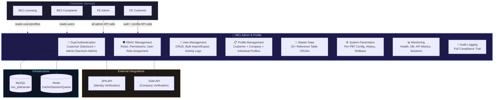
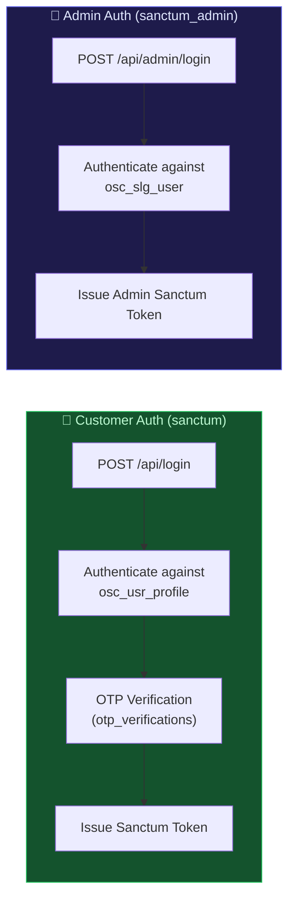
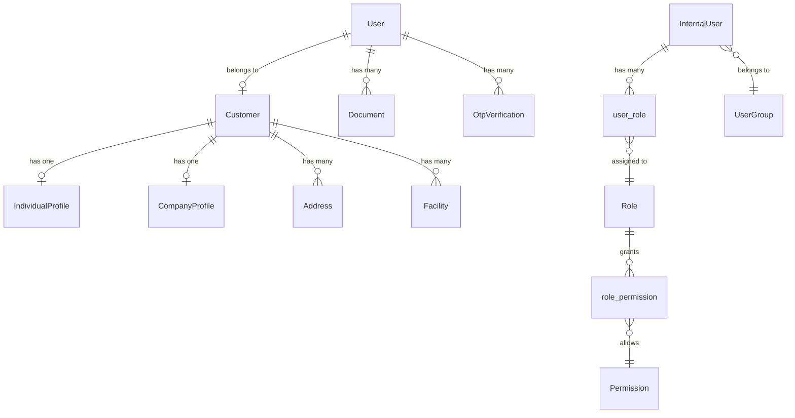

import { Tabs, Tab } from 'fumadocs-ui/components/tabs';

# BE1 Admin & Profile (OSC-BE1-ADMIN-PROFILE)

## 1. Overview

<div className="grid grid-cols-2 md:grid-cols-3 gap-3 my-6">
  <div className="bg-gradient-to-br from-blue-950 to-blue-900 border border-blue-700/50 rounded-lg p-4 text-center">
    <div className="text-3xl font-bold text-blue-300">19</div>
    <div className="text-xs text-blue-400 mt-1">Controllers</div>
  </div>
  <div className="bg-gradient-to-br from-emerald-950 to-emerald-900 border border-emerald-700/50 rounded-lg p-4 text-center">
    <div className="text-3xl font-bold text-emerald-300">32</div>
    <div className="text-xs text-emerald-400 mt-1">Eloquent Models</div>
  </div>
  <div className="bg-gradient-to-br from-violet-950 to-violet-900 border border-violet-700/50 rounded-lg p-4 text-center">
    <div className="text-3xl font-bold text-violet-300">31</div>
    <div className="text-xs text-violet-400 mt-1">Services</div>
  </div>
  <div className="bg-gradient-to-br from-amber-950 to-amber-900 border border-amber-700/50 rounded-lg p-4 text-center">
    <div className="text-3xl font-bold text-amber-300">38</div>
    <div className="text-xs text-amber-400 mt-1">Form Requests</div>
  </div>
  <div className="bg-gradient-to-br from-rose-950 to-rose-900 border border-rose-700/50 rounded-lg p-4 text-center">
    <div className="text-3xl font-bold text-rose-300">7</div>
    <div className="text-xs text-rose-400 mt-1">Middleware</div>
  </div>
  <div className="bg-gradient-to-br from-cyan-950 to-cyan-900 border border-cyan-700/50 rounded-lg p-4 text-center">
    <div className="text-3xl font-bold text-cyan-300">100+</div>
    <div className="text-xs text-cyan-400 mt-1">API Endpoints</div>
  </div>
</div>

**Repository**: osc-be1-admin-profile-main
**Name**: BE1 Admin & Profile
**Purpose**: Authentication, user/profile management, RBAC, master data administration, system monitoring
**Framework**: Laravel 12 on PHP 8.2+
**Database**: MySQL (`osc_pelesenan`) with Redis cache/session/queue layer
**Auth**: Laravel Sanctum ^4.2 (dual guards: `sanctum` for customers, `sanctum_admin` for internal staff)
**Docker Port**: 9001 (maps to container 9000)
**Status**: API-heavy, core identity and administration service

### System Role

BE1 is the **identity and administration hub** of the OSC platform. It manages:

- **Authentication**: Dual-track login for public customers (`osc_usr_profile`) and internal PBT staff (`osc_slg_user`) with OTP verification, password policy enforcement, and account locking after 5 failed attempts
- **RBAC**: Full role and permission management (custom-built, no Spatie) with hierarchy levels and data scoping (ALL/OWN/DEPARTMENT)
- **User Management**: Internal user CRUD, bulk import/export, activity tracking, force logout
- **Master Data**: CRUD for all `osc_kod_*` reference tables (PBTs, agencies, sectors, document types, complaint types, postcodes, etc.)
- **System Parameters**: Per-PBT configuration with change history, rollback, and impact analysis
- **Monitoring**: Health checks, database status, API metrics, error logs, job queue, active sessions, storage usage
- **External Integration**: JPN API (identity verification) and SSM API (company verification)



---

## 2. Tech Stack

<Tabs items={['PHP / Composer', 'Node / NPM', 'Docker', 'Key Packages']}>
  <Tab value="PHP / Composer">

**Production**
| Package | Version | Purpose |
|---------|---------|---------|
| `php` | ^8.2 | Runtime |
| `laravel/framework` | ^12.0 | Framework |
| `laravel/sanctum` | ^4.2 | API token authentication |
| `laravel/tinker` | ^2.10.1 | REPL |
| `dedoc/scramble` | ^0.13.11 | Auto-generated API documentation |
| `dompdf/dompdf` | ^3.1 | PDF generation |
| `owen-it/laravel-auditing` | ^14.0 | Model audit logging |
| `predis/predis` | ^3.3 | Redis PHP client |

**Dev**
| Package | Version |
|---------|---------|
| `fakerphp/faker` | ^1.23 |
| `larastan/larastan` | ^3.8 |
| `laravel/pail` | ^1.2.2 |
| `laravel/pint` | ^1.13 |
| `laravel/sail` | ^1.41 |
| `mockery/mockery` | ^1.6 |
| `nunomaduro/collision` | ^8.6 |
| `pestphp/pest` | ^3.8 |
| `pestphp/pest-plugin-laravel` | ^3.2 |
| `phpunit/phpunit` | ^11.5.3 |
| `phpstan/phpstan` | ^2.1 |

  </Tab>
  <Tab value="Node / NPM">

| Package | Version |
|---------|---------|
| `@tailwindcss/vite` | ^4.0.0 |
| `axios` | ^1.7.4 |
| `concurrently` | ^9.0.1 |
| `laravel-vite-plugin` | ^1.2.0 |
| `tailwindcss` | ^4.0.0 |
| `vite` | ^6.0.11 |

  </Tab>
  <Tab value="Docker">

**docker-compose.yml**
- **Service**: `be1-profile-admin`
- **Port**: `9001:9000`
- **Network**: `osc-network` (external)
- **Volume**: `./storage:/var/www/storage`
- **Health Check**: `GET http://localhost/health` (30s interval, 3 retries)

**Dockerfile** (Multi-stage)
- **Stage 1**: `composer:2` — install production dependencies
- **Stage 2**: `php:8.4-fpm-alpine` — production runtime
- **PHP Extensions**: pdo, pdo_mysql, mysqli, gd, zip, bcmath, intl, opcache, pcntl, redis
- **Process Manager**: Supervisor (nginx + php-fpm)

**Key Environment Variables**:
```
APP_NAME=OSC BE1 Profile Admin
APP_SERVICE=BE1
DB_HOST=osc-mysql
DB_DATABASE=osc_pelesenan
REDIS_HOST=osc-redis
CACHE_PREFIX=be1_
SANCTUM_STATEFUL_DOMAINS=localhost,127.0.0.1
BE2_URL=http://be2-licensing:9000
BE3_URL=http://be3-complaints-notif:9000
BE4_URL=http://be4-reporting:9000
BE5_URL=http://be5-enforcement:9000
BE6_URL=http://be6-chatbot:9000
```

  </Tab>
  <Tab value="Key Packages">

:::info
**`laravel/sanctum` ^4.2** — Dual-guard authentication. Customer tokens via `sanctum` guard, admin tokens via `sanctum_admin` guard with separate provider pointing to `InternalUser` model.
:::

:::info
**`dedoc/scramble` ^0.13.11** — Auto-generates OpenAPI/Swagger documentation from route definitions and form requests. Accessible via `/docs/api`.
:::

:::info
**`owen-it/laravel-auditing` ^14.0** — Automatic model change tracking for compliance audit trail.
:::

:::info
**`dompdf/dompdf` ^3.1** — Server-side PDF generation for reports and exports.
:::

  </Tab>
</Tabs>

---

## 3. Getting Started

<Tabs items={['Docker (Recommended)', 'Local (Without Docker)']}>
  <Tab value="Docker (Recommended)">

```bash
# Start the service (requires osc-network, osc-mysql, osc-redis running)
docker-compose up -d

# BE1 relies on BE0's migrations — ensure BE0 has migrated first

# Seed test data
docker-compose exec be1-profile-admin php artisan db:seed

# Seed internal users
docker-compose exec be1-profile-admin php artisan db:seed --class=InternalUserSeeder

# Seed roles and permissions
docker-compose exec be1-profile-admin php artisan db:seed --class=RolesAndPermissionsSeeder

# Run tests
docker-compose exec be1-profile-admin php artisan test
```

  </Tab>
  <Tab value="Local (Without Docker)">

```bash
composer install
cp .env.example .env
php artisan key:generate
# Ensure DB is migrated via BE0 first
php artisan db:seed
php artisan db:seed --class=InternalUserSeeder
php artisan db:seed --class=RolesAndPermissionsSeeder
npm install && npm run dev
php artisan serve
```

  </Tab>
</Tabs>

:::danger
**Schema dependency on BE0.** BE1 has NO migrations of its own. You must run BE0's migrations first to create all tables. Then seed BE1's roles, permissions, and test users.
:::

### Environment Configuration

```bash
APP_NAME="OSC BE1 Profile Admin"
APP_SERVICE=BE1
DB_CONNECTION=mysql
DB_HOST=mysql
DB_PORT=3306
DB_DATABASE=osc_pelesenan
DB_USERNAME=root
DB_PASSWORD=secret
CACHE_STORE=redis
CACHE_PREFIX=be1_
SESSION_DRIVER=redis
QUEUE_CONNECTION=redis
SANCTUM_STATEFUL_DOMAINS=localhost,127.0.0.1
SANCTUM_EXPIRATION=1440
```

---

## 4. Authentication

### Dual-Guard Architecture



**Customer Auth** (`auth:sanctum`):
- Login via `user_name` + `password` against `osc_usr_profile`
- OTP verification (6-digit, email-based)
- Account locking after 5 failed attempts (30 min lock)
- Registration: Individual (IC-based) or Company (SSM-based)
- Identity verification via JPN/SSM external APIs

**Admin Auth** (`auth:sanctum_admin`, throttled 30 req/min):
- Login via `user_name` + `password` against `osc_slg_user` (InternalUser model)
- Force password reset on first login
- No OTP for admin

### Auth Config (`config/auth.php`)

| Guard | Driver | Provider | Model |
|-------|--------|----------|-------|
| `sanctum` | Sanctum | `users` | `App\Models\User` (osc_usr_profile) |
| `sanctum_admin` | Sanctum | `internal_users` | `App\Models\InternalUser` (osc_slg_user) |

---

## 5. API Routes

### Public Routes (No Auth)

| Method | Path | Controller | Description |
|--------|------|-----------|-------------|
| GET | `/api/health` | inline | Health status (DB + Redis checks) |
| POST | `/api/register` | AuthController | Register new user |
| POST | `/api/register/individual` | AuthController | Register individual profile |
| POST | `/api/register/company` | AuthController | Register company profile |
| POST | `/api/verify-otp` | AuthController | Verify OTP code |
| POST | `/api/resend-otp` | AuthController | Resend OTP |
| POST | `/api/login` | AuthController | Customer login |
| POST | `/api/forgot-password` | AuthController | Request password reset |
| POST | `/api/reset-password` | AuthController | Reset password |
| POST | `/api/verify/individual-search` | AuthController | Search individual (JPN) |
| POST | `/api/verify/company-search` | AuthController | Search company (SSM) |
| POST | `/api/admin/login` | AdminAuthController | Admin login |
| POST | `/api/admin/forgot-password` | AdminAuthController | Admin forgot password |
| POST | `/api/admin/reset-password` | AdminAuthController | Admin reset password |

### Customer Routes (`auth:sanctum`)

| Method | Path | Controller | Description |
|--------|------|-----------|-------------|
| POST | `/api/logout` | AuthController | Logout |
| GET | `/api/me` | AuthController | Get current user info |
| GET | `/api/profile` | ProfileController | Show profile |
| PATCH | `/api/profile` | ProfileController | Update profile |
| POST | `/api/profile/contact/update` | ProfileController | Request contact change via OTP |
| POST | `/api/profile/contact/verify` | ProfileController | Verify contact change |
| PUT | `/api/profile/password` | ProfileController | Change password |
| POST | `/api/profile/close` | ProfileController | Request account closure |
| GET | `/api/profile/closure-status` | ProfileController | Check closure status |
| CRUD | `/api/addresses` | AddressController | Address management (max 10 per customer) |
| CRUD | `/api/documents` | DocumentController | Document upload/download (PDF/JPG/PNG, max 10MB) |

### Admin Routes (`auth:sanctum_admin`, throttle:30,1)

<Tabs items={['Account Mgmt', 'RBAC', 'User Mgmt', 'Master Data', 'System Config', 'Monitoring']}>
  <Tab value="Account Mgmt">

| Method | Path | Controller | Description |
|--------|------|-----------|-------------|
| POST | `/api/admin/logout` | AdminAuthController | Admin logout |
| GET | `/api/admin/dashboard/stats` | DashboardController | Dashboard statistics |
| GET/PUT | `/api/admin/profiles/{id}` | AdminProfileController | View/update profiles |
| GET | `/api/admin/closures/pending` | AdminAccountController | Pending closures |
| POST | `/api/admin/closures/{userId}/approve` | AdminAccountController | Approve closure |
| POST | `/api/admin/closures/{userId}/reject` | AdminAccountController | Reject closure |
| POST | `/api/admin/accounts/{userId}/approve` | AdminAccountController | Approve company |
| POST | `/api/admin/accounts/{userId}/reject` | AdminAccountController | Reject company |
| POST | `/api/admin/accounts/{userId}/suspend` | AdminAccountController | Suspend account |
| POST | `/api/admin/accounts/{userId}/reactivate` | AdminAccountController | Reactivate |
| POST | `/api/admin/accounts/{userId}/unlock` | AdminAccountController | Unlock locked |
| POST | `/api/admin/accounts/{userId}/force-logout` | AdminAccountController | Force logout |

  </Tab>
  <Tab value="RBAC">

| Method | Path | Controller |
|--------|------|-----------|
| CRUD | `/api/admin/roles` | RoleController |
| PATCH | `/api/admin/roles/{role}/activate\|deactivate` | RoleController |
| GET/POST | `/api/admin/roles/{role}/permissions` | RoleController |
| DELETE | `/api/admin/roles/{role}/permissions/{permission}` | RoleController |
| CRUD | `/api/admin/permissions` | PermissionController |
| GET | `/api/admin/permissions/modules/list` | PermissionController |
| GET | `/api/admin/permissions/actions/list` | PermissionController |
| GET | `/api/admin/permissions/grouped-by-module` | PermissionController |
| GET/POST/DELETE | `/api/admin/users/{userId}/roles` | UserRoleController |
| GET | `/api/admin/users/{userId}/permissions` | UserRoleController |

  </Tab>
  <Tab value="User Mgmt">

| Method | Path | Controller |
|--------|------|-----------|
| CRUD | `/api/admin/users` | UserManagementController |
| PATCH | `/api/admin/users/{id}/deactivate` | UserManagementController |
| POST | `/api/admin/users/{id}/reset-password` | UserManagementController |
| POST | `/api/admin/users/{id}/force-logout` | UserManagementController |
| GET | `/api/admin/users/{id}/activity` | UserManagementController |
| POST | `/api/admin/users/{id}/change-password` | UserManagementController |
| POST | `/api/admin/users/bulk-import` | UserManagementController |
| GET | `/api/admin/users/export` | UserManagementController |

  </Tab>
  <Tab value="Master Data">

All master data endpoints follow standard CRUD + activate/deactivate pattern under `/api/admin/master-data/`:

**PBTs** (`pbts`), **Control Codes** (`control-codes`), **States**, **Agencies**, **Sectors** (`sektors`), **Jenis** (types), **PTJPKs**, **Postcodes**, **Locations**, **Document Types** (`dokumen`), **Image Types** (`images`), **Complaint Types** (`kod-jenis-aduan`), **Blacklist Codes**, **Law Codes** (`kod-undang`), **Activity Codes** (`kod-aktiviti`), **Compound Acts** (`akta-kompaun`), **Offence Codes** (`kod-kesalahan`), **Trade Codes** (`kod-niaga`), **Majlis**

Controller: `MasterDataController` with 60+ methods

  </Tab>
  <Tab value="System Config">

| Method | Path | Controller |
|--------|------|-----------|
| CRUD | `/api/admin/parameters` | SystemParameterController |
| GET | `/api/admin/parameters/{key}/history` | SystemParameterController |
| POST | `/api/admin/parameters/{key}/rollback` | SystemParameterController |
| POST | `/api/admin/parameters/{key}/impact` | SystemParameterController |
| CRUD | `/api/admin/license-types` | LicenseTypeController |
| PATCH | `/api/admin/license-types/{id}/activate\|deactivate` | LicenseTypeController |
| GET | `/api/admin/pbt/{pbtCode}/configuration` | PbtConfigurationController |
| GET/PUT | `/api/admin/pbt/{pbtCode}/parameters/{key}` | PbtConfigurationController |

  </Tab>
  <Tab value="Monitoring">

| Method | Path | Controller |
|--------|------|-----------|
| CRUD | `/api/admin/audit-logs` | AuditLogController |
| GET | `/api/admin/audit-logs/search\|stats\|export` | AuditLogController |
| GET | `/api/admin/monitoring/health` | MonitoringController |
| GET | `/api/admin/monitoring/database` | MonitoringController |
| GET | `/api/admin/monitoring/api-metrics` | MonitoringController |
| GET | `/api/admin/monitoring/error-logs` | MonitoringController |
| GET | `/api/admin/monitoring/jobs` | MonitoringController |
| GET | `/api/admin/monitoring/sessions` | MonitoringController |
| POST | `/api/admin/monitoring/sessions/{userId}/force-logout` | MonitoringController |
| GET | `/api/admin/monitoring/storage` | MonitoringController |

  </Tab>
</Tabs>

---

## 6. Core Models

### Model Relationship Diagram



### Key Models

<Tabs items={['User & Customer', 'InternalUser & RBAC', 'Supporting Models']}>
  <Tab value="User & Customer">

**User** — `osc_usr_profile`
- Primary Key: `pfile_plgid` (string — IC number)
- Key Fields: `pfile_nama`, `pfile_emel`, `pfile_kata_laluan` (hidden), `pfile_statpemohon` (A=Active, P=Pending, S=Suspended)
- Traits: HasFactory, Notifiable, HasApiTokens
- Relationships: belongsTo Customer, hasMany Documents, hasMany OtpVerifications, belongsToMany Roles

**Customer** — `osc_da_pelanggan`
- Primary Key: `plgn_idpelanggan` (string — IC/SSM)
- Key Fields: `plgn_pelanggannama`, `plgn_pelangganjenis` (I=Individual, S=Company), `plgn_tinid`, `plgn_sstid`
- Relationships: hasOne IndividualProfile, hasOne CompanyProfile, hasMany Addresses, hasMany Facilities

**IndividualProfile** — `osc_da_individu`
- Key Fields: `indv_idpelanggan` (FK), `indv_lhdntinid` (NRIC), `indv_gelar`, `indv_jantina`, `indv_bangsa`, `indv_tarikhlahir`, `indv_jpnverified`

**CompanyProfile** — `osc_da_syarikat`
- Key Fields: `sykt_lhdnsstid`, `sykt_jenisniaga`, `sykt_statusbumi` (Y/T), `sykt_ssmverified`, `sykt_authorizedname`, `sykt_authorizedic`

**Address** — `osc_da_alamat`
- Key Fields: `almt_idpelanggan`, `almt_alamat01-05`, `almt_poskod`, `almt_nomborhp`, `almt_jenis` (HOME/OFFICE), `almt_default`

</Tab>
  <Tab value="InternalUser & RBAC">

**InternalUser** — `osc_slg_user`
- Primary Key: `user_id` (string)
- Key Fields: `user_name`, `user_email`, `user_password` (hidden), `user_status` (A/P/S), `user_group_id`, `majlis_code`, `jawatan`, `force_password_reset`, `status_kelulusan`
- Traits: HasFactory, Notifiable, HasApiTokens
- Relationships: belongsTo UserGroup, belongsToMany Roles, hasMany AuditLogs
- Custom: `setUserPasswordAttribute()` auto-hashes with bcrypt, prevents double-hashing

**Role** — `roles`
- Key Fields: `role_code` (PPSU, PPKT1, PPKT2, Pegawai, Admin, SuperAdmin, JKT), `role_name`, `hierarchy_level`, `is_active`, `is_system_role`
- Relationships: belongsToMany Users, belongsToMany Permissions
- Scopes: `active()`, `inactive()`, `orderByHierarchy()`

**Permission** — `permissions`
- Key Fields: `permission_code`, `permission_name`, `module`, `action`, `data_scope` (ALL/OWN/DEPARTMENT), `is_active`
- Relationships: belongsToMany Roles

</Tab>
  <Tab value="Supporting Models">

**Document** — `documents` (UUID primary key, versioned, PDF/JPEG/PNG max 10MB)

**AuditLog** — `audit_logs` (user_id, action, entity_type, entity_id, old_values, new_values, ip_address, user_agent)

**OtpVerification** — `otp_verifications` (6-digit code, purpose: register/login/contact_update, max attempts tracking)

**SystemParameter** — `osc_slg_sysparam` (per-PBT parameters with typed values)

**ParameterHistory** — `parameter_history` (tracks parameter changes with rollback support)

**Pbt** — `osc_kod_majlis` (PBT codes with HasPbtIsolation trait)

**Agency** — `osc_kod_agensi` (BTD=Internal, ATL=External categories)

**ApiKey** — `api_keys` (key generation with `osc_` prefix, type-based: payment_gateway/identity/company/etc.)

**UserGroup** — `osc_slg_usergrp` (hasMany InternalUsers)

**Facility** — `osc_da_kemudahan` (composite key, blacklist tracking)

  </Tab>
</Tabs>

---

## 7. Services

| Category | Services | Purpose |
|----------|----------|---------|
| **Auth** | LoginAttemptTracker, OtpVerificationService, IdentityVerificationService | Authentication & verification |
| **Registration** | IndividualRegistrationService, CompanyRegistrationService | Customer onboarding |
| **Account** | AccountClosureService, PasswordPolicyService | Account lifecycle |
| **RBAC** | RoleService, PermissionService | Role & permission CRUD |
| **User Management** | UserManagementService, UserImportService, UserExportService | Internal user admin |
| **Master Data** | MasterDataService, PbtConfigurationService | Reference data CRUD |
| **Integration** | JpnApiClient, SsmApiClient, SsmValidator, IcValidator | External API clients |
| **System** | SystemParameterService, LicenseTypeService, MonitoringService | System configuration |
| **Audit** | AuditLogger, AuditLogViewService, AuditLogExportService | Compliance audit |
| **Notification** | NotificationService, SessionManager | Alerts & session management |

---

## 8. Middleware

| Middleware | Purpose |
|-----------|---------|
| `CheckPasswordExpiry` | Validates password is not expired |
| `CheckPbtAccess` | Validates user has access to requested PBT |
| `CheckPermission` | Checks user permissions for action |
| `CheckRole` | Checks user roles |
| `DebugAuth` | Debug authentication (dev only) |
| `SetLocaleFromHeader` | Set locale from Accept-Language header |
| `TrackApiMetrics` | Track API performance metrics |

---

## 9. Notifications & Mail

| Class | Channel | Trigger |
|-------|---------|---------|
| `AccountStatusChanged` | mail | Account approved/rejected/suspended |
| `AdminResetPasswordNotification` | mail | Admin resets user password |
| `RoleAssignedNotification` | mail | Role assigned to user |
| `RoleRemovedNotification` | mail | Role removed from user |
| `WelcomeUserNotification` | mail | New user created |
| `OtpMail` | mail | OTP code delivery |
| `TestMail` | mail | Development test email |

---

## 10. Directory Structure

```
app/
├── Console/Commands/
├── Http/
│   ├── Controllers/Api/       (19 controllers)
│   ├── Middleware/             (7 middleware)
│   └── Requests/              (38 form requests)
├── Mail/
│   ├── OtpMail.php
│   └── TestMail.php
├── Models/                    (32 models)
├── Notifications/             (5 notification classes)
├── Policies/
│   ├── CustomerPolicy.php
│   └── DocumentPolicy.php
├── Providers/
│   ├── AppServiceProvider.php
│   └── AuthServiceProvider.php
├── Services/                  (31 service classes)
└── Traits/
    ├── HasPbtIsolation.php
    └── PtjpkTrait.php
```

---

## 11. Database

:::warning
**No migrations in BE1.** All database schema is managed by BE0's 190+ migrations. BE1 relies on the shared `osc_pelesenan` database.
:::

### Seeders

| Seeder | Purpose |
|--------|---------|
| `DatabaseSeeder` | Creates test user (ID: 900101011234) |
| `InternalUserSeeder` | Seeds internal PBT staff members |
| `RolesAndPermissionsSeeder` | Creates roles (PPSU, PPKT1, PPKT2, Pegawai, Admin, SuperAdmin, JKT) and permissions |

---

## 12. Testing & Quality

| Tool | Version | Purpose |
|------|---------|---------|
| Pest | ^3.8 | Testing framework |
| PHPUnit | ^11.5.3 | Unit testing |
| Larastan | ^3.8 | Static analysis for Laravel |
| PHPStan | ^2.1 | Static analysis |
| Laravel Pint | ^1.13 | Code style formatting |
