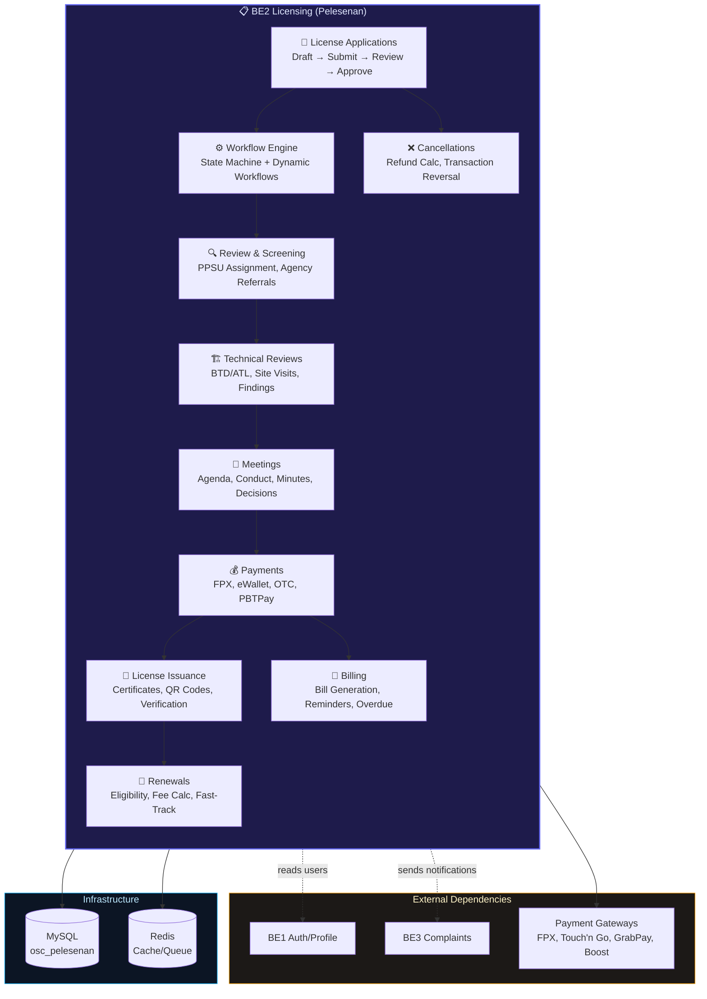
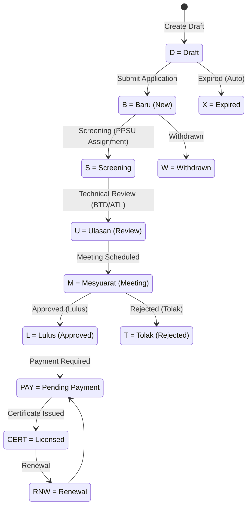
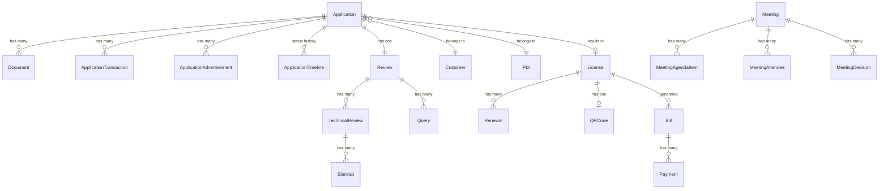
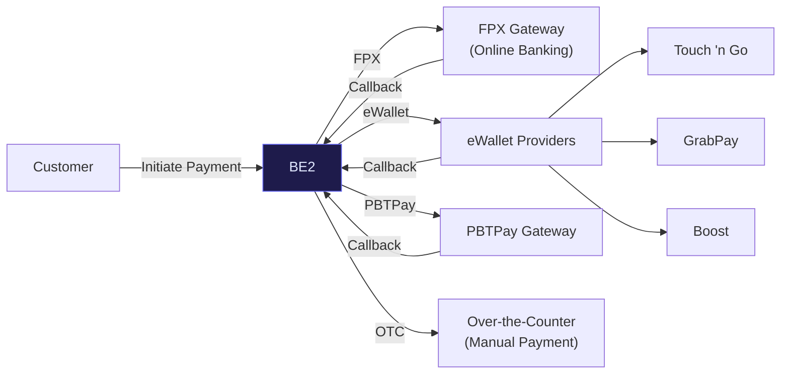

import { Tabs, Tab } from 'fumadocs-ui/components/tabs';

# BE2 Pelesenan / Licensing (OSC-BE2-PELESENAN)

## 1. Overview

<div className="grid grid-cols-2 md:grid-cols-4 gap-3 my-6">
  <div className="bg-gradient-to-br from-blue-950 to-blue-900 border border-blue-700/50 rounded-lg p-4 text-center">
    <div className="text-3xl font-bold text-blue-300">23</div>
    <div className="text-xs text-blue-400 mt-1">Controllers</div>
  </div>
  <div className="bg-gradient-to-br from-emerald-950 to-emerald-900 border border-emerald-700/50 rounded-lg p-4 text-center">
    <div className="text-3xl font-bold text-emerald-300">55</div>
    <div className="text-xs text-emerald-400 mt-1">Eloquent Models</div>
  </div>
  <div className="bg-gradient-to-br from-violet-950 to-violet-900 border border-violet-700/50 rounded-lg p-4 text-center">
    <div className="text-3xl font-bold text-violet-300">36</div>
    <div className="text-xs text-violet-400 mt-1">Services</div>
  </div>
  <div className="bg-gradient-to-br from-amber-950 to-amber-900 border border-amber-700/50 rounded-lg p-4 text-center">
    <div className="text-3xl font-bold text-amber-300">8</div>
    <div className="text-xs text-amber-400 mt-1">Async Jobs</div>
  </div>
  <div className="bg-gradient-to-br from-rose-950 to-rose-900 border border-rose-700/50 rounded-lg p-4 text-center">
    <div className="text-3xl font-bold text-rose-300">23+</div>
    <div className="text-xs text-rose-400 mt-1">Domain Events</div>
  </div>
  <div className="bg-gradient-to-br from-cyan-950 to-cyan-900 border border-cyan-700/50 rounded-lg p-4 text-center">
    <div className="text-3xl font-bold text-cyan-300">9</div>
    <div className="text-xs text-cyan-400 mt-1">Notifications</div>
  </div>
  <div className="bg-gradient-to-br from-pink-950 to-pink-900 border border-pink-700/50 rounded-lg p-4 text-center">
    <div className="text-3xl font-bold text-pink-300">200+</div>
    <div className="text-xs text-pink-400 mt-1">API Endpoints</div>
  </div>
  <div className="bg-gradient-to-br from-orange-950 to-orange-900 border border-orange-700/50 rounded-lg p-4 text-center">
    <div className="text-3xl font-bold text-orange-300">8</div>
    <div className="text-xs text-orange-400 mt-1">API Resources</div>
  </div>
</div>

**Repository**: osc-be2-pelesenan-main
**Name**: BE2 Licensing Service
**Purpose**: License applications, renewals, cancellations, payments, meetings, technical reviews, site visits, and workflow management
**Framework**: Laravel 12 on PHP 8.2+
**Database**: MySQL (`osc_pelesenan`) with Redis cache/session/queue layer
**Auth**: Laravel Sanctum ^4.0 (single `sanctum` guard)
**Docker Port**: 9002 (maps to container 9000)
**Status**: Core business logic service — the largest and most complex backend

:::info
**Pelesenan** = Licensing in Malay. This is the primary business engine of the OSC platform, handling the full lifecycle of business licenses: application → screening → technical review → meeting → approval → payment → certificate issuance → renewal → cancellation.
:::

### System Role



---

## 2. Tech Stack

<Tabs items={['PHP / Composer', 'Node / NPM', 'Docker', 'Key Packages']}>
  <Tab value="PHP / Composer">

**Production**
| Package | Version | Purpose |
|---------|---------|---------|
| `php` | ^8.2 | Runtime |
| `laravel/framework` | ^12.0 | Framework |
| `laravel/sanctum` | ^4.0 | API token authentication |
| `laravel/tinker` | ^2.10.1 | REPL |
| `barryvdh/laravel-dompdf` | ^3.1 | PDF certificate generation |
| `darkaonline/l5-swagger` | ^9.0 | Swagger API documentation |
| `endroid/qr-code` | ^6.1 | QR code generation for licenses |
| `maatwebsite/excel` | ^1.1 | Excel export |
| `predis/predis` | 2.2 | Redis client |

**Dev**
| Package | Version |
|---------|---------|
| `fakerphp/faker` | ^1.23 |
| `laravel/pail` | ^1.2.2 |
| `laravel/pint` | ^1.24 |
| `laravel/sail` | ^1.41 |
| `mockery/mockery` | ^1.6 |
| `nunomaduro/collision` | ^8.6 |
| `pestphp/pest` | ^3.8 |
| `pestphp/pest-plugin-laravel` | ^3.2 |
| `phpunit/phpunit` | ^11.5.3 |

  </Tab>
  <Tab value="Node / NPM">

| Package | Version |
|---------|---------|
| `@tailwindcss/vite` | ^4.0.0 |
| `axios` | ^1.11.0 |
| `concurrently` | ^9.0.1 |
| `laravel-vite-plugin` | ^2.0.0 |
| `tailwindcss` | ^4.0.0 |
| `vite` | ^7.0.7 |

  </Tab>
  <Tab value="Docker">

**docker-compose.yml**
- **Service**: `be2-licensing`
- **Port**: `9002:9000`
- **Network**: `osc-network` (external)
- **Volume**: `./storage:/var/www/storage`
- **Health Check**: `curl -f http://localhost/health` (30s interval, 3 retries)

**Dockerfile** (Multi-stage)
- **Stage 1**: `composer:2` — install production dependencies
- **Stage 2**: `php:8.4-fpm-alpine` — production runtime
- **PHP Extensions**: pdo, pdo_mysql, mysqli, gd, zip, bcmath, intl, opcache, pcntl, redis
- **Process Manager**: Supervisor (nginx + php-fpm)

**Dockerfile.worker** (Queue Worker)
- **Base**: `php:8.4-cli-alpine` (lighter, no FPM)
- **Command**: `php artisan queue:work --sleep=3 --tries=3`

**Key Environment Variables**:
```
APP_NAME=OSC BE2 Licensing Service
APP_SERVICE=BE2
DB_HOST=osc-mysql
DB_DATABASE=osc_pelesenan
REDIS_HOST=osc-redis
CACHE_PREFIX=be2_
BE1_URL=http://be1-profile-admin:9000
BE3_URL=http://be3-complaints-notif:9000
```

  </Tab>
  <Tab value="Key Packages">

:::info
**`endroid/qr-code` ^6.1** — Generates QR codes embedded in license certificates for verification. Scanned QR links to `/api/licenses/verify/qr` endpoint.
:::

:::info
**`barryvdh/laravel-dompdf` ^3.1** — Generates PDF license certificates via `CertificateGenerator` service. Stored at `ind_sijilpath` on the License model.
:::

:::info
**`maatwebsite/excel` ^1.1** — Excel export for bulk application data via `ApplicationsExport` class.
:::

:::info
**`darkaonline/l5-swagger` ^9.0** — Auto-generates Swagger/OpenAPI docs. Accessible via Swagger UI route.
:::

  </Tab>
</Tabs>

---

## 3. Getting Started

<Tabs items={['Docker (Recommended)', 'Local (Without Docker)']}>
  <Tab value="Docker (Recommended)">

```bash
# Ensure osc-network, osc-mysql, osc-redis are running (via BE0)
docker-compose up -d

# BE2 relies on BE0's migrations — ensure BE0 has migrated first
# Seed sample data
docker-compose exec be2-licensing php artisan db:seed

# Run queue worker (separate terminal)
docker-compose -f docker-compose.yml up be2-worker

# Run tests
docker-compose exec be2-licensing php artisan test
```

  </Tab>
  <Tab value="Local (Without Docker)">

```bash
composer install
cp .env.example .env
php artisan key:generate
# Ensure DB is migrated via BE0 first
php artisan db:seed
npm install && npm run dev
php artisan serve --port=9002
# Run queue worker
php artisan queue:work --sleep=3 --tries=3
```

  </Tab>
</Tabs>

:::danger
**Schema dependency on BE0.** BE2 has NO migrations of its own. You must run BE0's migrations first. BE2 seeds sample applications and renewal test data.
:::

---

## 4. Application Workflow (State Machine)



**Status Codes on `osc_mhn_permohonan.mhn_statl`:**
| Code | Malay | English | Description |
|------|-------|---------|-------------|
| D | Draf | Draft | Incomplete application |
| B | Baru | New | Submitted, awaiting screening |
| S | Saringan | Screening | PPSU officer reviewing |
| U | Ulasan | Review | Technical review by agencies |
| M | Mesyuarat | Meeting | Scheduled for committee meeting |
| L | Lulus | Approved | Application approved |
| T | Tolak | Rejected | Application rejected |
| X | Tamat | Expired | Auto-expired draft/license |
| W | Tarik Balik | Withdrawn | Customer withdrew |

---

## 5. API Routes

### Public Routes (No Auth)

<Tabs items={['Health & Verification', 'Drafts & Tracking', 'Master Data & Billing', 'Payments', 'Cancellation']}>
  <Tab value="Health & Verification">

| Method | Path | Controller | Description |
|--------|------|-----------|-------------|
| GET | `/api/health` | HealthCheckController | Comprehensive health (DB, Redis, storage) |
| GET | `/api/health/live` | HealthCheckController | Liveness probe |
| GET | `/api/health/ready` | HealthCheckController | Readiness probe |
| GET | `/api/licenses/verify/{licenseNumber}` | VerificationController | Verify license by number |
| POST | `/api/licenses/verify/qr` | VerificationController | Verify license by QR code |
| GET | `/api/applications/track/{referenceNumber}` | ApplicationController | Track application status |

  </Tab>
  <Tab value="Drafts & Tracking">

| Method | Path | Controller | Description |
|--------|------|-----------|-------------|
| POST | `/api/applications/draft` | ApplicationController | Create draft (anonymous) |
| PUT | `/api/applications/draft/{id}` | ApplicationController | Update draft |
| GET | `/api/applications/draft/{id}` | ApplicationController | View draft |
| POST | `/api/applications/draft/{id}/submit` | ApplicationController | Submit draft |
| GET | `/api/applications/{id}/details` | ApplicationController | Public view |
| GET | `/api/applications/{id}/document-requirements` | DocumentController | Required documents |
| GET/POST | `/api/applications/{id}/documents` | DocumentController | List/upload docs |
| DELETE | `/api/documents/{id}` | DocumentController | Delete document |
| GET/POST | `/api/applications/{id}/transactions` | TransactionController | Kod Niaga CRUD |
| PUT | `/api/applications/{id}/transactions/sync` | TransactionController | Sync transactions |
| GET | `/api/applications/{id}/deposit-summary` | TransactionController | Deposit summary |
| GET/PUT | `/api/applications/{id}/advertisements` | AdvertisementController | Iklan management |

  </Tab>
  <Tab value="Master Data & Billing">

| Method | Path | Controller |
|--------|------|-----------|
| GET | `/api/master-data/pbt` | MasterDataController |
| GET | `/api/master-data/pbt/{pbtId}/locations` | MasterDataController |
| GET | `/api/master-data/pbt/{pbtId}/license-types` | MasterDataController |
| GET | `/api/master-data/pbt/{pbtId}/jenis/{kodJenis}/sektors` | MasterDataController |
| GET | `/api/master-data/pbt/{pbtId}/sektor/{kodSektor}/aktivitis` | MasterDataController |
| GET | `/api/master-data/pbt/{pbtId}/aktiviti/{kodAktiviti}/niagas` | MasterDataController |
| GET | `/api/master-data/pbt/{pbtId}/documents` | MasterDataController |
| GET | `/api/master-data/application-types` | MasterDataController |
| GET | `/api/master-data/application-statuses` | MasterDataController |
| GET | `/api/master-data/lookup/{group}` | MasterDataController |
| GET | `/api/license-types` | LicenseTypeController |
| GET | `/api/license-types/public` | LicenseTypeController |
| GET | `/api/billing/application/{applicationId}` | BillingController |
| GET | `/api/billing/bill/{billId}` | BillingController |
| GET | `/api/billing/customer/{customerId}` | BillingController |
| GET | `/api/billing/customer/{customerId}/unpaid` | BillingController |
| POST | `/api/billing/generate/{applicationId}` | BillingController |

  </Tab>
  <Tab value="Payments">

| Method | Path | Controller |
|--------|------|-----------|
| POST | `/api/payments/callback/{paymentMethod}` | PaymentController |
| POST | `/api/pbtpay/initiate/{billId}` | PbtPayController |
| POST | `/api/pbtpay/callback` | PbtPayController |
| GET | `/api/pbtpay/status/{refno}` | PbtPayController |

  </Tab>
  <Tab value="Cancellation">

| Method | Path | Controller |
|--------|------|-----------|
| GET | `/api/cancellation/accounts/{customerId}` | CancellationController |
| POST | `/api/cancellation/license-info` | CancellationController |
| POST | `/api/cancellation/transaksi-lesen` | CancellationController |
| POST | `/api/cancellation/cancel` | CancellationController |
| POST | `/api/cancellation/cancel-account` | CancellationController |
| GET | `/api/customer-profile/{customerId}` | ApplicationController |
| PUT | `/api/customer-profile/{customerId}` | ApplicationController |
| GET | `/api/applications/customer/{customerId}` | ApplicationController |
| GET | `/api/licenses/customer/{customerId}` | LicenseController |
| GET | `/api/licenses/senarai/{customerId}` | JanaSijilController |

  </Tab>
</Tabs>

### Customer Routes (`auth:sanctum`)

<Tabs items={['Applications', 'Licenses & Renewals', 'Documents & Payments']}>
  <Tab value="Applications">

| Method | Path | Controller |
|--------|------|-----------|
| POST | `/api/applications/submit` | ApplicationController |
| GET | `/api/applications` | ApplicationController |
| GET | `/api/applications/{id}` | ApplicationController |
| DELETE | `/api/applications/draft/{id}` | ApplicationController |
| POST | `/api/applications/{id}/withdraw` | ApplicationController |
| GET | `/api/applications/{id}/history` | ApplicationController |
| GET | `/api/applications/{id}/transitions` | ApplicationController |
| GET | `/api/applications/{id}/payment` | ApplicationController |
| GET | `/api/applications/search` | SearchController |
| GET | `/api/applications/search/export` | SearchController |
| GET | `/api/applications/search/recent` | SearchController |
| GET | `/api/applications/search/filters` | SearchController |

  </Tab>
  <Tab value="Licenses & Renewals">

| Method | Path | Controller |
|--------|------|-----------|
| GET | `/api/licenses` | LicenseController |
| GET | `/api/licenses/{id}` | LicenseController |
| GET | `/api/licenses/{id}/download` | LicenseController |
| POST | `/api/licenses/{id}/reissue` | LicenseController |
| GET | `/api/licenses/{id}/details` | LicenseController |
| GET | `/api/licenses/{id}/renewal-eligibility` | LicenseController |
| GET | `/api/licenses/{id}/renewal-fee` | LicenseController |
| POST | `/api/licenses/{id}/renewal-draft` | LicenseController |
| GET | `/api/licenses/{id}/eligibility` | RenewalController |
| POST | `/api/renewals/initiate` | RenewalController |
| GET | `/api/renewals` | RenewalController |
| GET | `/api/renewals/{id}` | RenewalController |
| POST | `/api/renewals/{id}/submit` | RenewalController |
| POST | `/api/renewals/{id}/fast-track` | RenewalController |
| GET | `/api/renewals/{id}/fee-preview` | LicenseController |
| POST | `/api/renewals/submit` | LicenseController |

  </Tab>
  <Tab value="Documents & Payments">

| Method | Path | Controller |
|--------|------|-----------|
| POST | `/api/documents/upload/{applicationId}` | DocumentController |
| GET | `/api/documents/application/{applicationId}` | DocumentController |
| GET | `/api/documents/validate-mandatory/{applicationId}` | DocumentController |
| GET | `/api/documents/types` | DocumentController |
| DELETE | `/api/documents/{documentId}` | DocumentController |
| GET | `/api/documents/download/{documentId}` | DocumentController |
| POST | `/api/payments/{billId}/initiate` | PaymentController |
| POST | `/api/payments/otc/{billId}` | PaymentController |
| POST | `/api/payments/verify/{transactionRef}` | PaymentController |
| GET | `/api/payments/methods` | PaymentController |
| GET | `/api/payments/status/{billId}` | PaymentController |

  </Tab>
</Tabs>

### Admin Routes

<Tabs items={['Applications & Reviews', 'Syor Keputusan', 'Technical Reviews & Site Visits', 'Meetings', 'Cancellations & Bulk Ops', 'Email & Notifications']}>
  <Tab value="Applications & Reviews">

| Method | Path | Controller |
|--------|------|-----------|
| GET | `/api/admin/applications` | Admin\ApplicationController |
| GET | `/api/admin/applications/{id}` | Admin\ApplicationController |
| POST | `/api/admin/applications/{id}/review` | Admin\ApplicationController |
| GET | `/api/admin/applications/{id}/review-agencies` | Admin\ApplicationController |
| GET | `/api/admin/applications/{id}/ulasan-summary` | Admin\ApplicationController |
| POST | `/api/reviews/{id}/screening/complete` | ReviewController |
| POST | `/api/reviews/{id}/queries` | ReviewController |
| POST | `/api/reviews/{id}/technical-referral` | ReviewController |
| POST | `/api/reviews/{id}/recommendation` | ReviewController |
| GET | `/api/reviews/{id}` | ReviewController |
| GET | `/api/reviews/{id}/queries` | ReviewController |
| GET | `/api/reviews/{id}/technical-reviews` | ReviewController |
| POST | `/api/queries/{id}/respond` | ReviewController |
| POST | `/api/queries/{id}/review` | ReviewController |

  </Tab>
  <Tab value="Syor Keputusan">

Syor Keputusan = Recommendations/Decisions

| Method | Path | Controller |
|--------|------|-----------|
| GET | `/api/admin/syor-keputusan` | SyorKeputusanController |
| GET | `/api/admin/syor-keputusan/application/{appId}/history` | SyorKeputusanController |
| GET | `/api/admin/syor-keputusan/syor/{syorId}/attachments` | SyorKeputusanController |
| POST | `/api/admin/syor-keputusan/ulasan/{ulasanId}/review` | SyorKeputusanController |
| POST | `/api/admin/syor-keputusan/ulasan/{ulasanId}/escalate` | SyorKeputusanController |
| CRUD | `/api/admin/syor-keputusan/{applicationId}` | SyorKeputusanController |
| CRUD | `/api/admin/syor-keputusan/{applicationId}/syor/{syorId}` | SyorKeputusanController |

  </Tab>
  <Tab value="Technical Reviews & Site Visits">

| Method | Path | Controller |
|--------|------|-----------|
| POST | `/api/technical-reviews/{id}/submit` | TechnicalReviewController |
| POST | `/api/technical-reviews/{id}/site-visit` | TechnicalReviewController |
| GET | `/api/technical-reviews/{id}/site-visits` | TechnicalReviewController |
| GET | `/api/site-visits/upcoming` | SiteVisitController |
| GET | `/api/site-visits/{id}` | SiteVisitController |
| PATCH | `/api/site-visits/{id}/confirm` | SiteVisitController |
| PATCH | `/api/site-visits/{id}/reschedule` | SiteVisitController |
| POST | `/api/site-visits/{id}/findings` | SiteVisitController |
| POST | `/api/site-visits/{id}/follow-up` | SiteVisitController |
| PATCH | `/api/site-visits/{id}/cancel` | SiteVisitController |

  </Tab>
  <Tab value="Meetings">

| Method | Path | Controller |
|--------|------|-----------|
| GET/POST | `/api/meetings` | MeetingController |
| GET | `/api/meetings/upcoming` | MeetingController |
| GET | `/api/meetings/requiring-quorum` | MeetingController |
| POST | `/api/meetings/{number}/start` | MeetingController |
| POST | `/api/meetings/{number}/complete` | MeetingController |
| PATCH | `/api/meetings/{number}/cancel` | MeetingController |
| GET/POST | `/api/meetings/{number}/agenda` | MeetingController |
| POST | `/api/meetings/{number}/agenda/generate` | MeetingController |
| POST | `/api/meetings/{number}/agenda/items` | MeetingController |
| GET | `/api/meetings/{number}/attendees` | MeetingController |
| POST | `/api/meetings/{number}/members` | MeetingController |
| GET | `/api/meetings/{number}/agenda-items` | MeetingController |
| POST | `/api/meetings/{number}/conduct` | MeetingController |
| GET | `/api/meetings/{number}/decisions` | MeetingController |
| GET/PUT/POST | `/api/meetings/{number}/minutes` | MeetingController |
| POST | `/api/meetings/{number}/minutes/generate` | MeetingController |
| GET/PATCH | `/api/meetings/{number}` | MeetingController |
| POST | `/api/agenda-items/{id}/decision` | MeetingController |

  </Tab>
  <Tab value="Cancellations & Bulk Ops">

| Method | Path | Controller |
|--------|------|-----------|
| GET | `/api/admin/pembatalan-transaksi` | AdminCancellationController |
| GET | `/api/admin/pembatalan-transaksi/{id}` | AdminCancellationController |
| POST | `/api/admin/pembatalan-transaksi/{id}/confirm` | AdminCancellationController |
| POST | `/api/admin/pembatalan-transaksi/{id}/reject` | AdminCancellationController |
| POST | `/api/admin/pembatalan-transaksi/{induklesenId}/confirm-all` | AdminCancellationController |
| POST | `/api/admin/pembatalan-transaksi/{induklesenId}/reject-all` | AdminCancellationController |
| POST | `/api/applications/bulk/assign` | BulkOperationsController |
| POST | `/api/applications/bulk/update-status` | BulkOperationsController |
| POST | `/api/applications/bulk/export` | BulkOperationsController |
| POST | `/api/applications/bulk/validate` | BulkOperationsController |
| CRUD | `/api/license-types` | LicenseTypeController |
| PATCH | `/api/license-types/{id}/activate` | LicenseTypeController |
| PATCH | `/api/license-types/{id}/deactivate` | LicenseTypeController |
| GET | `/api/license-types/{id}/form-fields` | LicenseTypeController |
| GET | `/api/license-types/{id}/workflow-rules` | LicenseTypeController |
| POST | `/api/documents/replace/{documentId}` | DocumentController |

  </Tab>
  <Tab value="Email & Notifications">

| Method | Path | Controller |
|--------|------|-----------|
| CRUD | `/api/admin/email-templates` | EmailTemplateController |
| GET | `/api/admin/email-templates/code/{code}` | EmailTemplateController |
| GET | `/api/admin/email-templates/{id}/preview` | EmailTemplateController |
| PATCH | `/api/admin/email-templates/{id}/toggle` | EmailTemplateController |
| POST | `/api/admin/email-templates/{id}/test` | EmailTemplateController |
| GET | `/api/admin/notifications` | NotificationController |
| GET | `/api/admin/notifications/unread-count` | NotificationController |
| POST | `/api/admin/notifications` | NotificationController |
| PATCH | `/api/admin/notifications/{id}/read` | NotificationController |
| PATCH | `/api/admin/notifications/{id}/unread` | NotificationController |
| PATCH | `/api/admin/notifications/mark-all-read` | NotificationController |
| PATCH | `/api/admin/notifications/mark-selected-read` | NotificationController |

  </Tab>
</Tabs>

---

## 6. Core Models

### Model Relationship Diagram



### Key Models

<Tabs items={['Application & License', 'Review & Meeting', 'Payment & Billing', 'Supporting Models']}>
  <Tab value="Application & License">

**Application** — `osc_mhn_permohonan`
- Primary Key: `id` (int)
- Key Fields: `mhn_norujukan` (reference number), `mhn_idpbt`, `mhn_idpelanggan`, `mhn_statl` (status: D/B/L/T/X), `mhn_langkahwf` (workflow step), `mhn_tkmohon` (application date)
- Addresses, contact, location, sektor, aktiviti, niaga details
- Relationships: belongsTo Customer/Pbt, hasMany Documents/Transactions/Advertisements/Timeline, hasOne Review

**License** — `osc_ind_induklesen`
- Primary Key: `ind_id` (int)
- Key Fields: `ind_nomborlesen`, `ind_idpermohonan` (FK), `ind_idpelanggan` (FK), `ind_status`, `ind_tarikhkeluaran` (issue date), `ind_tarikhtamat` (expiry date), `ind_tempohsah` (validity days), `ind_sijilpath` (certificate PDF)
- Relationships: belongsTo Application/Customer/LicenseType/Pbt, hasOne QRCode, hasMany Renewals

**Renewal** — `renewals`
- Key Fields: `renewal_license_id`, `renewal_application_id`, status, dates, fee information
- Relationships: belongsTo License/Application

**LicenseType** — `license_types`
- Key Fields: `code`, `name`, `category`, `pbt_code`, `is_active`, `form_fields` (JSON), `document_requirements` (JSON), `fee_structure` (JSON), `workflow_rules` (JSON)
- Methods: `createVersion()`

</Tab>
  <Tab value="Review & Meeting">

**Review** — `osc_smk_semakan`
- Primary Key: `smk_id`
- Key Fields: `smk_idpermohonan`, `smk_idppsu` (PPSU officer), `smk_status`, `smk_tahaptahap` (risk level), `smk_tarikhagih` (assignment), `smk_tarikhsiap` (completion), `smk_syor` (recommendation)
- Relationships: belongsTo Application/Officer, hasMany Queries/TechnicalReviews/ChecklistItems

**TechnicalReview** — `osc_mhn_ulasan`
- Key Fields: `uls_jenis` (BTD=Internal/ATL=External), `uls_jabatan` (department), `uls_idpenyemak` (reviewer), `uls_perlulawatn` (site visit needed), `uls_penemuan` (findings JSON), `uls_syor` (recommendation)

**SiteVisit** — `site_visits`
- Key Fields: `scheduled_date`, `scheduled_time`, `officer_id`, `status`, `findings` (JSON), `photos` (JSON array)

**Query** — `queries`
- Key Fields: `query_type` (DOCUMENT/INFORMATION/CLARIFICATION), `query_deficiencies` (JSON), `query_cycle` (1/2/3 for rounds), `query_deadline`, `query_status`

**Meeting** — `osc_smk_mesyuarat`
- Key Fields: `msy_bilangan` (meeting number), `msy_kdsrpbt`, `msy_tkhmesyuarat`, `msy_statf` (S=completed), `msy_max_peserta`
- Relationships: hasMany Agenda/AgendaItems/Attendees/Decisions/Minutes

</Tab>
  <Tab value="Payment & Billing">

**Bill** — `osc_bil_bayaran`
- Helper Methods: `isUnpaid()`, `isPartiallyPaid()`, `isPaid()`, `isOverdue()`, `isCancelled()`, `getTotalPaidAmount()`, `getRemainingBalance()`, `getDaysUntilDue()`, `getDaysOverdue()`
- Scopes: `byStatus`, `byType`, `unpaid`, `paid`

**Payment** — `payments`
- Key Fields: `payment_bill_id`, `payment_amount` (decimal), `payment_method` (FPX/TOUCH_N_GO/etc.), `payment_status`, `payment_transaction_id`

**Document** — `osc_mhn_dokumen`
- Key Fields: `doc_permohonan` (FK), file metadata (path, type, size, version)
- Methods: `getFileExtension()`, `getFormattedFileSize()`

</Tab>
  <Tab value="Supporting Models">

| Model | Table | Purpose |
|-------|-------|---------|
| Customer | `osc_da_pelanggan` | Read-only from BE1 |
| User | `osc_usr_profile` | Shared with BE1, HasApiTokens |
| InternalUser | `osc_slg_user` | Staff users, managed by BE1 |
| Pbt | `osc_kod_majlis` | PBT reference data |
| ApplicationAdvertisement | `osc_mhn_iklan` | License advertisements |
| ApplicationImage | `osc_mhn_gambar` | Application images |
| ApplicationTimeline | `osc_mhn_kronologi` | Status change history |
| ApplicationTransaction | `osc_mhn_transaksi` | Kod Niaga transactions |
| ApplicationWorker | `osc_mhn_pekerja` | Worker records |
| BillReminder | `bill_reminders` | Payment reminder tracking |
| ChecklistItem | `checklist_items` | Screening checklist |
| EmailTemplate | `email_templates` | Configurable email templates |
| Notification | `notifications` | In-app notifications |
| QRCode | `qr_codes` | License QR codes |
| Recommendation | `recommendations` | Review recommendations |
| Refund | `refunds` | Cancellation refunds |
| SyorKeputusan | — | Recommendation decisions |
| SyorAttachment | — | Recommendation attachments |
| VerificationLog | `verification_logs` | License verification audit |

  </Tab>
</Tabs>

---

## 7. Services

| Category | Services | Purpose |
|----------|----------|---------|
| **Workflow** | ApplicationStateMachine, DynamicWorkflowService, WorkflowEngine, StateTransitionService | State machine, workflow orchestration |
| **Application** | PermohonanLesenService, DraftService, StatusTrackingService, ValidationService | Application lifecycle |
| **Review** | ScreeningService, TechnicalReviewService, QueryService, RecommendationService | Review pipeline |
| **Meeting** | MeetingService, AgendaService, DecisionService, MinutesService | Meeting management |
| **Payment** | PaymentService, PaymentGatewayService, PbtPayService, BillService | Payment processing |
| **License** | CertificateGenerator, QRCodeService, VerificationService | Certificate & verification |
| **Renewal** | RenewalService, EligibilityService, FeeCalculatorService, FastTrackService, LicenseService, GracePeriodService | Renewal pipeline |
| **Cancellation** | CancellationService, RefundCalculatorService | Cancellation & refunds |
| **Operations** | BulkOperationService, SearchService, ApplicationAgencyService, ApprovalService, SiteVisitService | Admin operations |
| **Infrastructure** | CircuitBreakerService, RetryService, SLAMonitorService, SequenceGeneratorService, NotificationService | Resilience & monitoring |

---

## 8. Async Jobs

| Job | Purpose |
|-----|---------|
| `BillOverdueJob` | Handle overdue bill notifications |
| `CheckApplicationReviewCompletion` | Check review completion status |
| `DraftExpirationJob` | Expire old draft applications |
| `LicenseExpiryWarningJob` | Send license expiry warnings |
| `PaymentReminderJob` | Send payment reminders |
| `QueryExpirationJob` | Expire unanswered queries |
| `RenewalReminderJob` | Send renewal reminders |
| `SLAMonitoringJob` | Monitor SLA compliance |

---

## 9. Events & Listeners

### Domain Events (23+)

| Category | Events |
|----------|--------|
| **Application** | ApplicationSubmitted, ApplicationStatusChanged, ApplicationApproved, ApplicationRejected, ApplicationPendingPayment, ApplicationReadyForApproval, ApplicationLicenseIssued, ApplicationQueryIssued |
| **Document** | DocumentUploaded, DocumentReplaced, DocumentExpired, DocumentMalwareDetected |
| **Query** | QueryIssued, QueryResponded, QueryResolved, QueryExpired |
| **Review** | ScreeningCompleted, ReviewConsolidated, TechnicalReviewAssigned, TechnicalReviewCompleted |
| **Site Visit** | SiteVisitScheduled, SiteVisitRescheduled, SiteVisitCompleted |

### Listeners

| Listener | Reacts To |
|----------|-----------|
| GenerateBillOnPendingPayment | ApplicationPendingPayment |
| SendApplicationSubmittedNotification | ApplicationSubmitted |
| SendLicenseIssuedNotification | ApplicationLicenseIssued |
| SendPaymentReminderNotification | Bill overdue |
| SendQueryIssuedNotification | QueryIssued |
| SendStatusChangeNotification | ApplicationStatusChanged |

---

## 10. Payment Gateway Integration



**Config** (`config/payment_gateways.php`):
- Currency: MYR
- Timeout: 30 minutes
- Payment methods: FPX (enabled), eWallet (enabled), Touch'n Go, GrabPay, Boost, OTC
- Each gateway has merchant config, API endpoints, and callback URLs

---

## 11. Notifications

| Notification | Channel | Trigger |
|-------------|---------|---------|
| AgencyReviewNotification | mail | Technical review assigned to agency |
| ApplicationAssignedNotification | mail | Application assigned to officer |
| ApplicationStatusNotification | mail | Application status changes |
| MeetingReviewNotification | mail | Meeting review required |
| MeetingUpdateNotification | mail | Meeting schedule changes |
| RenewalReminderNotification | mail | License approaching expiry |
| TemplatedEmail | mail | Configurable email template |
| TestEmailNotification | mail | Development testing |
| UlasanUpdatedNotification | mail | Technical review updated |

---

## 12. Directory Structure

```
app/
├── Console/Commands/           (mail:test command)
├── Events/                     (23+ domain events)
├── Exports/
│   └── ApplicationsExport.php  (Maatwebsite Excel)
├── Http/
│   ├── Controllers/
│   │   ├── Admin/              (ApplicationController, EmailTemplateController,
│   │   │                        NotificationController, SyorKeputusanController,
│   │   │                        InternalUserController)
│   │   ├── JanaSijil/          (JanaSijilController)
│   │   ├── LicenseApplication/ (ApplicationController, AdvertisementController,
│   │   │                        DocumentController, TransactionController)
│   │   ├── LicenseCancellation/(CancellationController, AdminCancellationController)
│   │   ├── LicenseRenewal/     (LicenseController, RenewalController)
│   │   ├── BillingController, BulkOperationsController, HealthCheckController,
│   │   │   LicenseTypeController, MasterDataController, MeetingController,
│   │   │   PaymentController, PbtPayController, ReviewController,
│   │   │   SearchController, SiteVisitController, VerificationController
│   │   └── Controller.php (base)
│   ├── Middleware/
│   │   └── AuthenticateServiceToken.php
│   ├── Requests/               (8+ form request classes)
│   └── Resources/              (8 API resource classes)
├── Jobs/                       (8 async jobs)
├── Listeners/                  (6 event listeners)
├── Mail/                       (notifications used instead)
├── Models/                     (55 models)
├── Notifications/              (9 notification classes)
├── Observers/
│   └── MhnUlasanObserver.php
├── Services/
│   ├── LicenseApplication/     (DraftService, StatusTrackingService, ValidationService)
│   ├── LicenseCancellation/    (CancellationService, RefundCalculatorService)
│   ├── LicenseRenewal/         (EligibilityService, FastTrackService, FeeCalculatorService,
│   │                            LicenseService, RenewalService)
│   └── (20+ root-level services)
└── Traits/
    └── NotifiesUser.php
```

---

## 13. Configuration

| Config File | Key Settings |
|-------------|-------------|
| `payment_gateways.php` | FPX, eWallet, Touch'n Go, GrabPay, Boost, OTC settings, MYR currency |
| `pbtpay.php` | PBTPay gateway-specific config |
| `health_check.php` | DB, Redis, storage, services checks enabled |
| `l5-swagger.php` | Swagger API documentation config |
| `auth.php` | Single `sanctum` guard, `users` provider → `App\Models\User` |
| `cache.php` | Redis default, 1hr TTL, `be2_` prefix |
| `queue.php` | Redis default |
| `mail.php` | SMTP via smtp4dev (dev), from `be2-licensing@osc-lesen.local` |

---

## 14. Testing

| Tool | Version | Purpose |
|------|---------|---------|
| Pest | ^3.8 | Testing framework |
| PHPUnit | ^11.5.3 | Unit testing |
| Laravel Pint | ^1.24 | Code style |

### Seeders

| Seeder | Purpose |
|--------|---------|
| `RealisticApplicationSeeder` | 3 sample application records |
| `RenewalSampleDataSeeder` | Renewal test data for customer |
