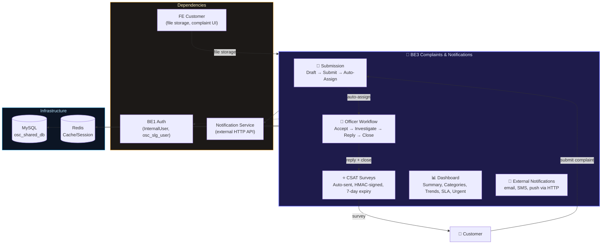
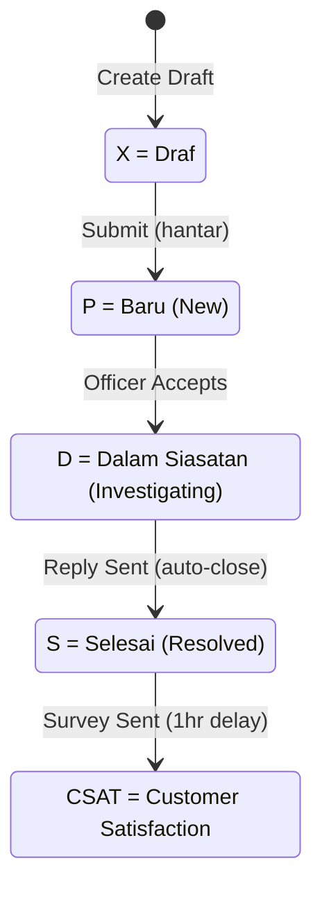
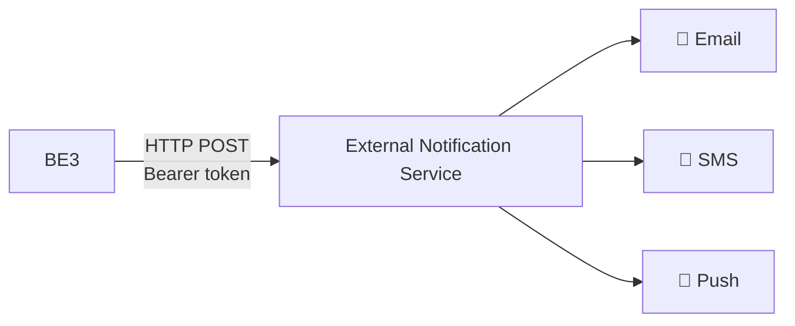

import { Tabs, Tab } from 'fumadocs-ui/components/tabs';

# BE3 Aduan & Notifikasi (OSC-BE3-ADUAN-DAN-NOTIFIKASI)

## 1. Overview

<div className="grid grid-cols-2 md:grid-cols-3 gap-3 my-6">
  <div className="bg-gradient-to-br from-blue-950 to-blue-900 border border-blue-700/50 rounded-lg p-4 text-center">
    <div className="text-3xl font-bold text-blue-300">3</div>
    <div className="text-xs text-blue-400 mt-1">Controllers</div>
  </div>
  <div className="bg-gradient-to-br from-emerald-950 to-emerald-900 border border-emerald-700/50 rounded-lg p-4 text-center">
    <div className="text-3xl font-bold text-emerald-300">13</div>
    <div className="text-xs text-emerald-400 mt-1">Models (7 active + 4 legacy + 2 shared)</div>
  </div>
  <div className="bg-gradient-to-br from-violet-950 to-violet-900 border border-violet-700/50 rounded-lg p-4 text-center">
    <div className="text-3xl font-bold text-violet-300">5</div>
    <div className="text-xs text-violet-400 mt-1">Services</div>
  </div>
  <div className="bg-gradient-to-br from-amber-950 to-amber-900 border border-amber-700/50 rounded-lg p-4 text-center">
    <div className="text-3xl font-bold text-amber-300">25</div>
    <div className="text-xs text-amber-400 mt-1">API Endpoints</div>
  </div>
  <div className="bg-gradient-to-br from-rose-950 to-rose-900 border border-rose-700/50 rounded-lg p-4 text-center">
    <div className="text-3xl font-bold text-rose-300">4</div>
    <div className="text-xs text-rose-400 mt-1">Officer Roles</div>
  </div>
  <div className="bg-gradient-to-br from-cyan-950 to-cyan-900 border border-cyan-700/50 rounded-lg p-4 text-center">
    <div className="text-3xl font-bold text-cyan-300">1</div>
    <div className="text-xs text-cyan-400 mt-1">Form Request</div>
  </div>
</div>

**Repository**: osc-be3-aduan-dan-notifikasi-main
**Name**: BE3 Complaints & Notifications
**Purpose**: Complaint submission, officer assignment, response workflow, CSAT surveys, and dashboard analytics
**Framework**: Laravel 12 on PHP 8.2+
**Database**: MySQL (`osc_shared_db` / `osc_pelesenan`) with Redis cache/session/queue
**Auth**: Laravel Sanctum ^4.2 (officer routes via `sanctum` guard → `InternalUser` model)
**Docker Port**: 9003 (maps to container 9000)
**Status**: Lean, focused microservice for complaint lifecycle management

:::info
**Aduan** = Complaint, **Notifikasi** = Notification in Malay. This service manages the complete complaint lifecycle from customer submission through officer investigation to resolution and customer satisfaction surveys.
:::

### System Role



---

## 2. Tech Stack

<Tabs items={['PHP / Composer', 'Node / NPM', 'Docker']}>
  <Tab value="PHP / Composer">

**Production**
| Package | Version | Purpose |
|---------|---------|---------|
| `php` | ^8.2 | Runtime |
| `laravel/framework` | ^12.0 | Framework |
| `laravel/sanctum` | ^4.2 | Officer API token auth |
| `laravel/tinker` | ^2.10.1 | REPL |

**Dev**
| Package | Version |
|---------|---------|
| `fakerphp/faker` | ^1.23 |
| `laravel/pint` | ^1.13 |
| `laravel/sail` | ^1.41 |
| `mockery/mockery` | ^1.6 |
| `nunomaduro/collision` | ^8.6 |
| `pestphp/pest` | ^3.8 |
| `pestphp/pest-plugin-laravel` | ^3.2 |
| `phpunit/phpunit` | ^11.5.3 |

:::warning
BE3 is the leanest backend — no DomPDF, no Excel, no Swagger, no QR codes. Just core Laravel + Sanctum.
:::

  </Tab>
  <Tab value="Node / NPM">

| Package | Version |
|---------|---------|
| `axios` | ^1.7.4 |
| `laravel-vite-plugin` | ^1.2.0 |
| `vite` | ^6.0.11 |

  </Tab>
  <Tab value="Docker">

**docker-compose.yml**
- **Service**: `be3-complaints-notif`
- **Port**: `9003:9000`
- **Network**: `osc-network` (external)
- **Volume**: `./storage:/var/www/storage`
- **Health Check**: `curl -f http://localhost/api/health` (30s interval, 3 retries, 60s start period)

**Dockerfile** (Multi-stage)
- **Stage 1**: `composer:2` — install dependencies
- **Stage 2**: `php:8.4-fpm-alpine` — production runtime
- **PHP Extensions**: pdo, pdo_mysql, mysqli, gd, zip, bcmath, intl, opcache, pcntl, redis
- **Process Manager**: Supervisor (nginx + php-fpm)

**Key Environment Variables**:
```
APP_NAME=BE3 Complaints & Notifications
APP_TIMEZONE=Asia/Kuala_Lumpur
DB_HOST=osc-mysql
DB_DATABASE=osc_shared_db
REDIS_HOST=osc-redis
CACHE_PREFIX=be3_
```

  </Tab>
</Tabs>

---

## 3. Getting Started

```bash
# Docker (requires osc-network, osc-mysql, osc-redis)
docker-compose up -d

# IMPORTANT: BE3 has NO migrations and NO seeders
# All tables are managed by BE0. Ensure BE0 has migrated first.

# Run tests
docker-compose exec be3-complaints-notif php artisan test
```

:::danger
**No migrations, no seeders, no factories.** BE3 is a pure API service that reads/writes to shared tables managed by BE0.
:::

---

## 4. Complaint Lifecycle



| Status | Code | Malay | English | Assignment Status |
|--------|------|-------|---------|-------------------|
| Draft | X | Draf | Draft | — |
| New | P | Baru | New/Pending | P (Pending) |
| Investigating | D | Dalam Siasatan | In Progress | A (Active) |
| Resolved | S | Selesai | Resolved | S (Closed) |

**Complaint Number Format**: `ADU-{YEAR}-{SEQUENCE}` (e.g., `ADU-2026-0001`) — yearly global sequence with row locking

**SLA**: Default 14 days from submission, configurable per complaint category via `kat_piagam`

---

## 5. API Routes

### Public Routes (No Auth)

| Method | Path | Controller | Method | Description |
|--------|------|-----------|--------|-------------|
| GET | `/api/health` | Closure | — | Health check (JSON) |
| GET | `/api/complaints/form-data` | AduanController | `cipta()` | Load form data (PBT list + categories) |
| GET | `/api/complaints` | AduanController | `senarai()` | List customer's complaints (paginated, requires `id_pelanggan`) |
| POST | `/api/complaints` | AduanController | `hantar()` | Submit or save draft complaint |
| GET | `/api/complaints/verify-attachment` | AduanController | `verifyAttachment()` | Verify file belongs to customer |
| GET | `/api/complaints/verify-file-exists` | AduanController | `verifyFileExists()` | Verify file exists in DB |
| GET | `/api/complaints/{id}` | AduanController | `show()` | View complaint detail (ownership check) |
| PUT | `/api/complaints/{id}` | AduanController | `update()` | Update draft (can promote to submitted) |
| GET | `/api/complaints/{id}/csat/validate` | AduanController | `validateCsatForForm()` | Validate CSAT token |
| POST | `/api/complaints/{id}/csat` | AduanController | `submitCsat()` | Submit CSAT rating (1-5) |

### Officer Routes (`auth:sanctum`, prefix: `/api/officer`)

| Method | Path | Controller | Method | Description |
|--------|------|-----------|--------|-------------|
| GET | `/api/officer/dashboard` | OfficerController | `dashboard()` | Assigned complaints + stats (role-filtered) |
| GET | `/api/officer/complaints/{id}` | OfficerController | `show()` | Detail with audit log, can_close flag |
| POST | `/api/officer/complaints/{id}/accept` | OfficerController | `accept()` | Accept ticket (P→D) |
| POST | `/api/officer/complaints/{id}/reassign` | OfficerController | `reassign()` | Reassign to another officer |
| POST | `/api/officer/complaints/{id}/reply/draft` | OfficerController | `saveDraft()` | Save draft reply |
| POST | `/api/officer/complaints/{id}/reply/send` | OfficerController | `sendReply()` | Send reply (auto-closes ticket) |
| POST | `/api/officer/complaints/{id}/close` | OfficerController | `close()` | Close with mandatory rumusan |
| POST | `/api/officer/complaints/{id}/documents` | OfficerController | `uploadDocument()` | Upload files (max 3, 5MB) |
| GET | `/api/officer/complaints/attachments/{id}/download` | OfficerController | `downloadOfficerAttachment()` | Download attachment |

### Dashboard Routes (prefix: `/api/dashboard`)

| Method | Path | Controller | Method | Description |
|--------|------|-----------|--------|-------------|
| GET | `/api/dashboard/ringkasan` | DashboardController | `ringkasan()` | Summary stats + sparklines |
| GET | `/api/dashboard/kategori` | DashboardController | `kategori()` | Category breakdown by year |
| GET | `/api/dashboard/trend` | DashboardController | `trend()` | Monthly trend per category |
| GET | `/api/dashboard/piagam` | DashboardController | `piagam()` | Resolution time distribution |
| GET | `/api/dashboard/urgent` | DashboardController | `urgent()` | Urgent complaints (SLA at risk) |

---

## 6. Officer Roles & Access

| Role | Code | Access Scope | Can Accept | Can Reassign | Can Close |
|------|------|-------------|-----------|-------------|-----------|
| PPSU | PPSU | Own department only | ✅ | ❌ | ✅ |
| BTD | BTD | Own department | ✅ | ✅ | ✅ |
| PBT Admin | PBT | All in PBT + unassigned | ✅ | ✅ | ✅ |
| JKT | JKT | Cross-PBT read-only | ❌ | ❌ | ❌ |
| ATL | ATL | Blocked from assignments | ❌ | ❌ | ❌ |

---

## 7. Models

<Tabs items={['Core Models', 'Reference Models', 'Legacy Models']}>
  <Tab value="Core Models">

**OscAduanIndaduan** — `osc_adn_indaduan` (Main Complaint)
- Key Fields: `adn_idpbt`, `adn_noaduan`, `adn_idpelanggan`, `adn_namaplgn`, `adn_kodjenisaduan`, `adn_tajuk`, `adn_catatan`, `adn_lokasi`, `adn_stataduan` (X/P/D/S), `adn_sla_due_date`, `adn_tkhselesai`, `adn_reopen_count`
- Relationships: belongsTo Kategori/Pbt, hasMany Lampiran/Agihan/AuditLog, hasOne Csat
- Scopes: `byPelanggan`, `byStatus`, `byPbt`
- Accessors: `status_label` (X→Draf, P→Baru, D→Dalam Siasatan, S→Selesai), `jenis_label` (A→Aduan, P→Pertanyaan)

**OscAduanAgihan** — `osc_adn_agihan` (Assignment/Response)
- Key Fields: `agh_noaduan`, `agh_ptjpk` (department), `agh_pegawai` (officer), `agh_ulasan` (response JSON), `agh_statadn` (P/A/D/S), `agh_tkhbalas` (reply date)
- Scopes: `byOfficer`, `pending`, `inProgress`, `auditTrail`, `maklumBalas`, `tindakan`

**OscAduanGbraduan** — `osc_adn_gbraduan` (Attachments)
- Key Fields: `img_noaduan`, `img_imgnama`, `img_source` (C=Complainant, O=Officer), `img_filetype`, `img_filesize`, `img_scan_status`
- Scopes: `bySource`, `complainantFiles`, `officerFiles`

**OscAduanCsat** — `osc_adn_csat` (Customer Satisfaction)
- Key Fields: `csat_noaduan`, `csat_skor` (1-5), `csat_komen`, `csat_tkhskor`
- Accessor: `rating_label` (1→Sangat Tidak Berpuas Hati ... 5→Sangat Berpuas Hati)

**OscAduanLog** — `osc_adn_log` (Audit Log)
- Constants: `ACTION_CIPTA`, `ACTION_AGIH`, `ACTION_AGIH_SEMULA`, `ACTION_TERIMA`, `ACTION_DRAF_BALAS`, `ACTION_HANTAR_BALAS`, `ACTION_TUTUP`, `ACTION_CSAT_HANTAR`
- Static: `createLog()` helper

</Tab>
  <Tab value="Reference Models">

**OscKodJenisaduan** — `osc_kod_jenisaduan` (Complaint Categories)
- Key Fields: `kat_idpbt`, `kat_kodjenisaduan`, `kat_keterangan`, `kat_piagam` (SLA days), `kat_ptjpk` (auto-assign dept), `kat_statf`
- Scopes: `active`, `byPbt`

**OscKodMajlis** — `osc_kod_majlis` (PBT/Local Authority)
- Shared reference data from BE0
- Relationships: hasMany Aduan/Kategori

**InternalUser** — `osc_slg_user` (Officer, shared from BE1)
- Auth methods: `getAuthPassword()` → `user_password`
- Roles: PPSU, BTD, PBT, JKT

</Tab>
  <Tab value="Legacy Models">

These are simpler duplicate mappings to the same tables (kept for backward compatibility):
- `Aduan.php` → `osc_adn_indaduan`
- `AduanAgihan.php` → `osc_adn_agihan`
- `AduanGambar.php` → `osc_adn_gbraduan`
- `KodJenisAduan.php` → `osc_kod_jenisaduan`

</Tab>
</Tabs>

---

## 8. Services

| Service | Injected | Purpose |
|---------|----------|---------|
| **AduanService** | NotificationService | Draft save, complaint submission (ADU-{YEAR}-{SEQ} generation with row locking), SLA calculation (14d default), auto-assign by category, file metadata storage, audit trail, CSAT save |
| **OfficerService** | NotificationService | Accept ticket (P→D), reassign (same-PBT validation), save/send reply, auto-close on reply, close with rumusan, CSAT row creation, sends 3 notifications on reply (replied, closed, CSAT survey) |
| **OfficerAuthService** | — | PBT access validation, role validation, combined access+role checks. JKT can access all PBTs |
| **DashboardService** | — | Summary stats with sparklines, category breakdown, monthly trends (top 3), resolution time distribution (≤1d, 2-3d, 4-7d, >7d), urgent/SLA-at-risk complaints |
| **NotificationService** | — | External HTTP integration (Bearer token). Sends: status updates, receipt confirmations, reassignment alerts, reply notifications, closure notifications, CSAT survey (60min delay, 7-day expiry with HMAC token) |

---

## 9. Configuration

### Custom Config: `config/aduan.php`

| Setting | Value |
|---------|-------|
| **File Upload** | Max 5 files/complaint, 5 files/reply, 5MB images, 10MB documents. Allowed: jpeg, jpg, png, webp, pdf |
| **Virus Scan** | Disabled by default (clamav/cloudmersive providers) |
| **Workflow** | Complainant reply disabled, complainant close disabled, reopen within 30 days, max 1 reopen |
| **Auto-Assignment** | Enabled, workload-based strategy |
| **SLA Escalation** | 80% → assigned officer, 100% → +supervisor, 120% → +PBT admin |
| **CSAT** | 7-day expiry, 1-hour delayed email, no multiple submissions, not mandatory |
| **Rate Limiting** | 10 complaints/day, 5 complaints/hour |

### Auth Config (`config/auth.php`)

| Guard | Driver | Provider | Model |
|-------|--------|----------|-------|
| `web` | session | `users` | `App\Models\User` |
| `sanctum` | sanctum | `internal_users` | `App\Models\InternalUser` |

### External Services (`config/services.php`)
- `notification.url` → `NOTIFICATION_SERVICE_URL`
- `notification.api_key` → `NOTIFICATION_SERVICE_API_KEY`
- `fe_customer.url` → `FE_CUSTOMER_URL` (default: `http://localhost:8001`)

---

## 10. Form Validation

### HantarAduanRequest

| Field | Rules |
|-------|-------|
| `pbt_id` | required, string, max:10, exists:osc_kod_majlis,maj_idpbt |
| `kategori_id` | required, string, max:10 |
| `jenis` | nullable, in:A,P (Aduan/Pertanyaan) |
| `tajuk` | required, string, min:3, max:500 |
| `nama_pengadu` | nullable, string, max:100 |
| `no_kp` | required, string, max:15 |
| `keterangan` | required, string, min:5, max:5000 |
| `lokasi` | nullable, string, max:500 |
| `action` | nullable, in:draft,submit |
| `lampiran` | nullable, array, max:5 (path, nama_asal, saiz, jenis) |

Custom Malay error messages. Input sanitized with `strip_tags(trim())`.

---

## 11. Notification Integration

BE3 uses **external HTTP-based notifications** (no local Events/Listeners/Jobs/Mail classes):



| Event | Channels | Delay |
|-------|----------|-------|
| Complaint received | email, SMS | — |
| Status updated | email, SMS, push | — |
| Reassigned | email, push | — |
| Reply sent | email, SMS, push | — |
| Complaint closed | email, SMS, push | — |
| CSAT survey | email | 60 min |
| Complaint reopened | email, push | — |

---

## 12. Directory Structure

```
app/
├── Helpers/
│   └── ApiResponse.php          (success/error JSON helpers)
├── Http/
│   ├── Controllers/
│   │   ├── AduanController.php  (complaint submission, CSAT)
│   │   ├── DashboardController.php (analytics)
│   │   └── OfficerController.php   (officer workflow)
│   ├── Middleware/
│   │   └── Authenticate.php     (API-only, no redirect)
│   └── Requests/
│       └── HantarAduanRequest.php (Malay validation messages)
├── Models/
│   ├── OscAduanIndaduan.php     (main complaint)
│   ├── OscAduanAgihan.php       (assignment/response)
│   ├── OscAduanGbraduan.php     (attachments)
│   ├── OscAduanCsat.php         (satisfaction rating)
│   ├── OscAduanLog.php          (audit log)
│   ├── OscKodJenisaduan.php     (categories)
│   ├── OscKodMajlis.php         (PBT reference)
│   ├── InternalUser.php         (officer, shared from BE1)
│   ├── User.php                 (default Laravel)
│   └── (4 legacy duplicate models)
├── Providers/
│   └── AppServiceProvider.php   (empty)
└── Services/
    ├── AduanService.php         (complaint lifecycle)
    ├── OfficerService.php       (officer workflow)
    ├── OfficerAuthService.php   (access validation)
    ├── DashboardService.php     (analytics)
    └── NotificationService.php  (external HTTP integration)
```
