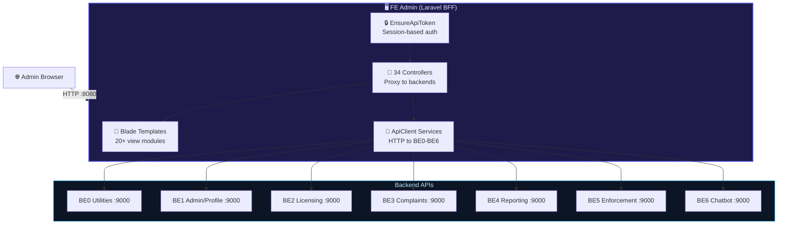
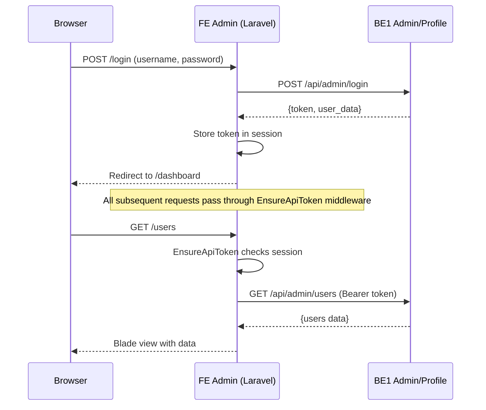

import { Tabs, Tab } from 'fumadocs-ui/components/tabs';

# FE Admin — Administrator Portal (OSC-FE-ADMIN)

## 1. Overview

<div className="grid grid-cols-2 md:grid-cols-3 gap-3 my-6">
  <div className="bg-gradient-to-br from-blue-950 to-blue-900 border border-blue-700/50 rounded-lg p-4 text-center">
    <div className="text-3xl font-bold text-blue-300">34</div>
    <div className="text-xs text-blue-400 mt-1">Controllers</div>
  </div>
  <div className="bg-gradient-to-br from-emerald-950 to-emerald-900 border border-emerald-700/50 rounded-lg p-4 text-center">
    <div className="text-3xl font-bold text-emerald-300">7</div>
    <div className="text-xs text-emerald-400 mt-1">Eloquent Models</div>
  </div>
  <div className="bg-gradient-to-br from-violet-950 to-violet-900 border border-violet-700/50 rounded-lg p-4 text-center">
    <div className="text-3xl font-bold text-violet-300">4</div>
    <div className="text-xs text-violet-400 mt-1">API Client Services</div>
  </div>
  <div className="bg-gradient-to-br from-amber-950 to-amber-900 border border-amber-700/50 rounded-lg p-4 text-center">
    <div className="text-3xl font-bold text-amber-300">7</div>
    <div className="text-xs text-amber-400 mt-1">Backend Proxies (BE0-BE6)</div>
  </div>
  <div className="bg-gradient-to-br from-rose-950 to-rose-900 border border-rose-700/50 rounded-lg p-4 text-center">
    <div className="text-3xl font-bold text-rose-300">20+</div>
    <div className="text-xs text-rose-400 mt-1">Blade View Modules</div>
  </div>
  <div className="bg-gradient-to-br from-cyan-950 to-cyan-900 border border-cyan-700/50 rounded-lg p-4 text-center">
    <div className="text-3xl font-bold text-cyan-300">2</div>
    <div className="text-xs text-cyan-400 mt-1">Custom Middleware</div>
  </div>
</div>

**Repository**: osc-fe-admin-main
**Name**: FE Admin — Administrator Portal
**Purpose**: BFF (Backend-For-Frontend) admin dashboard proxying to 7 backend microservices
**Framework**: Laravel 12 + Blade + Vue 3 (headless) + Alpine.js + Tailwind CSS 4
**Auth**: Session-based with API token in session (`EnsureApiToken` middleware)
**Docker Port**: 8080 (maps to container 80)
**Status**: Full admin portal — no local business database, all data from BE0-BE6

:::warning
**This is NOT a React/Next.js app.** FE Admin is a **Laravel Blade** application with **Alpine.js** for reactivity, **Vue 3** (headless, no SFCs) for the sidebar, and multiple JS libraries (Chart.js, ApexCharts, CKEditor, Quill, SweetAlert2, Toastr) exposed on `window`. All business data comes from backend APIs.
:::

### Architecture Pattern



---

## 2. Tech Stack

<Tabs items={['PHP / Composer', 'Node / NPM', 'Docker', 'Frontend Libraries']}>
  <Tab value="PHP / Composer">

**Production**
| Package | Version | Purpose |
|---------|---------|---------|
| `php` | ^8.2 | Runtime |
| `laravel/framework` | ^12.0 | Framework |
| `laravel/tinker` | ^2.10.1 | REPL |

**Dev**
| Package | Version |
|---------|---------|
| `fakerphp/faker` | ^1.23 |
| `laravel/pail` | ^1.2.2 |
| `laravel/pint` | ^1.24 |
| `laravel/sail` | ^1.41 |
| `mockery/mockery` | ^1.6 |
| `nunomaduro/collision` | ^8.6 |
| `pestphp/pest` | ^4.2 |
| `pestphp/pest-plugin-laravel` | ^4.0 |

:::info
Minimal PHP dependencies — no Sanctum, no DomPDF, no database packages. This is a pure BFF.
:::

  </Tab>
  <Tab value="Node / NPM">

**Production Dependencies**
| Package | Version | Purpose |
|---------|---------|---------|
| `@ckeditor/ckeditor5-build-classic` | ^41.4.2 | Rich text editor |
| `@fontsource/poppins` | ^5.2.7 | Font |
| `apexcharts` | ^4.7.0 | Advanced charts |
| `quill` | ^1.3.7 | Rich text editor (alternative) |

**Dev Dependencies**
| Package | Version | Purpose |
|---------|---------|---------|
| `vue` | ^3.4.0 | UI framework (headless sidebar) |
| `@vitejs/plugin-vue` | ^6.0.3 | Vue Vite plugin |
| `alpinejs` | ^3.15.8 | Lightweight reactivity |
| `@alpinejs/collapse` | ^3.15.8 | Alpine collapse plugin |
| `tailwindcss` | ^4.0.0 | CSS framework |
| `@tailwindcss/vite` | ^4.0.0 | Tailwind Vite plugin |
| `chart.js` | ^4.5.1 | Charts |
| `sweetalert2` | ^11.26.21 | Modal dialogs |
| `toastr` | ^2.1.4 | Toast notifications |
| `jquery` | ^4.0.0 | DOM manipulation |
| `axios` | ^1.11.0 | HTTP client |
| `vite` | ^6.0.0 | Build tool |
| `laravel-vite-plugin` | ^1.0.0 | Laravel integration |
| `concurrently` | ^9.0.1 | Parallel scripts |

  </Tab>
  <Tab value="Docker">

**docker-compose.yml**
- **Service**: `fe-admin`
- **Port**: `8080:80`
- **Network**: `osc-network` (external)
- **Volume**: `./storage:/var/www/storage`
- **Health Check**: `curl -f http://localhost/health` (30s interval, 60s start period)

**Dockerfile** (3-stage build)
1. **Stage 1** (`node:20-alpine`): `npm ci` + `npm run build` — bundles all JS/CSS
2. **Stage 2** (`composer:2`): Install PHP production deps
3. **Stage 3** (`php:8.4-fpm-alpine`): Runtime with nginx + php-fpm via supervisor

**Key Environment Variables**:
```
APP_NAME=OSC FE Admin
SESSION_DRIVER=file
CACHE_STORE=file
BE0_URL=http://be0-utilities:9000
BE1_URL=http://be1-profile-admin:9000
BE2_URL=http://be2-licensing:9000
BE3_URL=http://be3-complaints-notif:9000
BE4_URL=http://be4-reporting:9000
BE5_URL=http://be5-enforcement:9000
BE6_URL=http://be6-chatbot:9000
```

  </Tab>
  <Tab value="Frontend Libraries">

All exposed globally on `window` via `app.js`:

| Library | Global | Purpose |
|---------|--------|---------|
| Alpine.js | `Alpine` | Reactive DOM bindings (sidebar, forms, toggles) |
| Vue 3 | — | Headless sidebar controller (no SFCs) |
| jQuery 4 | `$`, `jQuery` | DOM manipulation |
| Chart.js | `Chart` | Dashboard charts |
| ApexCharts | `ApexCharts` | Advanced dashboard charts |
| SweetAlert2 | `Swal` | Modal confirmations/alerts |
| Toastr | `toastr` | Toast notifications |
| CKEditor 5 | — | Rich text editing |
| Quill | `Quill` | Rich text editing (alternative) |

  </Tab>
</Tabs>

---

## 3. Getting Started

```bash
# Docker (requires osc-network + all BE services running)
docker-compose up -d

# Local development
composer install
npm install
cp .env.example .env
php artisan key:generate
npm run dev   # Vite dev server
php artisan serve --port=8080
```

:::danger
**No local database needed.** FE Admin has no migrations, no seeders for business data. All data comes from BE0-BE6 via HTTP. Session and cache use `file` driver by default.
:::

---

## 4. Authentication Flow



- **Login**: Proxied to BE1 `/api/admin/login`. Token stored in Laravel session.
- **Middleware**: `EnsureApiToken` checks for valid `api_token` in session on every protected route.
- **Force password change**: Redirects to `/change-password` on first login.
- **Language**: `SetLocale` middleware reads session locale (switchable via `/language/switch`).

---

## 5. Web Routes

### Public (No Auth)

| Method | Path | Controller | Description |
|--------|------|-----------|-------------|
| GET | `/login` | LoginController | Login form |
| POST | `/login` | LoginController | Authenticate (→ BE1) |
| POST | `/logout` | LoginController | Logout |
| POST | `/language/switch` | LanguageController | Switch locale |
| GET/POST | `/forgot-password` | LoginController | Password reset request |
| GET/POST | `/reset-password/{token}` | LoginController | Reset with token |
| GET/POST | `/change-password` | LoginController | Force password change |

### Protected (`EnsureApiToken` middleware)

<Tabs items={['Dashboard & Profile', 'Applications & Licenses', 'Users & Profiles', 'Meetings & Site Visits', 'Complaints', 'Syor Keputusan', 'Master Data (19 modules)', 'Email & Notifications', 'Monitoring']}>
  <Tab value="Dashboard & Profile">

| Method | Path | Controller | Description |
|--------|------|-----------|-------------|
| GET | `/` | DashboardController | Main dashboard |
| GET | `/profile` | ProfileController | Edit own profile |
| PUT | `/profile` | ProfileController | Update profile |
| PUT | `/profile/password` | ProfileController | Change password |

  </Tab>
  <Tab value="Applications & Licenses">

| Method | Path | Controller |
|--------|------|-----------|
| GET | `/applications` | ApplicationController@index |
| GET | `/applications/semakan` | ApplicationController@semakan (screening) |
| GET | `/applications/action` | ApplicationController@action |
| GET | `/applications/{id}` | ApplicationController@show |
| POST | `/applications/{id}/review` | ApplicationController@review |
| POST | `/applications/{id}/reassign-meeting` | ApplicationController@reassignMeeting |
| GET | `/applications/{id}/license-summary` | ApplicationController@licenseSummary |
| POST | `/applications/{id}/approve` | ApplicationController@approve |
| POST | `/applications/{id}/postpone` | ApplicationController@postpone |
| POST | `/applications/{id}/reject` | ApplicationController@reject |
| GET | `/applications/screening` | Blade placeholder |
| GET | `/applications/technical` | Blade placeholder |
| GET | `/applications/approval` | Blade placeholder |
| GET | `/licenses` | Blade placeholders (index, renewals, history) |

  </Tab>
  <Tab value="Users & Profiles">

| Method | Path | Controller |
|--------|------|-----------|
| CRUD | `/users` | UserManagementController |
| GET | `/users/pbt-ppt` | UserManagementController@getPbtPptUsers |
| GET | `/users/{id}/activity` | UserManagementController@activity |
| POST | `/users/{id}/toggle-status` | UserManagementController@toggleStatus |
| GET | `/users/roles` | Blade view |
| GET | `/profiles` | PublicProfileController@index |
| GET/PUT | `/profiles/{id}` | PublicProfileController (show/edit/update) |
| GET | `/profiles/{id}/activity` | PublicProfileController@activity |
| POST | `/profiles/{id}/toggle-status` | PublicProfileController@toggleStatus |
| GET | `/profiles/pending-approval` | Blade view |
| GET | `/profiles/closures` | Blade view |

  </Tab>
  <Tab value="Meetings & Site Visits">

| Method | Path | Controller |
|--------|------|-----------|
| Resource | `/meetings` | MeetingController (index/create/store/show/edit/update/destroy) |
| POST | `/meetings/{meeting}/members` | MeetingController@storeMember |
| PATCH | `/meetings/{meeting}/members/{member}/status` | MeetingController@updateMemberStatus |
| DELETE | `/meetings/{meeting}/members/{member}` | MeetingController@destroyMember |
| DELETE | `/meetings/{meeting}/applications/{application}` | MeetingController@destroyApplication |
| GET/PUT | `/meetings/{meeting}/minutes` | MeetingController@minutes/updateMinutes |
| GET | `/meetings/{meeting}/minutes/print` | MeetingController@printMinutes |
| GET | `/site-visits` | Blade placeholder |

  </Tab>
  <Tab value="Complaints">

| Method | Path | Controller |
|--------|------|-----------|
| GET | `/complaints` | ComplaintController@index (dashboard/analytics) |
| GET | `/complaints/list` | ComplaintController@list |
| GET | `/complaints/{id}` | ComplaintController@show |
| GET | `/complaints/{id}/reply` | ComplaintController@replyForm |
| POST | `/complaints/{id}/accept` | ComplaintController@accept |
| POST | `/complaints/{id}/reassign` | ComplaintController@reassign |
| POST | `/complaints/{id}/reply/draft` | ComplaintController@saveDraft |
| POST | `/complaints/{id}/reply/send` | ComplaintController@sendReply |
| POST | `/complaints/{id}/close` | ComplaintController@close |
| POST | `/complaints/{id}/documents` | ComplaintController@uploadDocument |
| GET | `/api/master-data/ptjpks` | ComplaintController@getDepartments |
| GET | `/api/users/officers` | ComplaintController@getOfficers |

  </Tab>
  <Tab value="Syor Keputusan">

~20 routes for recommendation management: CRUD, review, escalate, attachments, file downloads.

Controller: `SyorKeputusanController`

  </Tab>
  <Tab value="Master Data (19 modules)">

All master data follows CRUD + activate/deactivate pattern. Controllers:

| Module | Controller | Notes |
|--------|-----------|-------|
| Parameter AM | ParameterAmController | + history/rollback |
| Agencies | AgencyController | |
| Sektors | SektorController | Composite key: `{pbtCode}/{sektorCode}/{jenisCode}` |
| PTJPKs | PtjpkController | |
| Lookup Table | LookupTableController | |
| Majlis (PBT) | MajlisController | |
| Postcodes | PostcodeController | |
| Locations | LocationController | + API dropdown |
| Audit Trail | AuditController | Read-only (index/show) |
| Dokumen | DokumenController | |
| Images | ImageController | |
| Kod Jenis | KodJenisController | |
| Kod Jenis Aduan | KodJenisAduanController | |
| Kod List Hitam | KodListHitamController | |
| Akta Kompaun | AktaKompaunController | + check-code/check-reference |
| Kod Kesalahan | KodKesalahanController | |
| Kod Aktiviti | KodAktivitiController | |
| Kod Undang | KodUndangController | Composite key |
| Kod Niaga | KodNiagaController | |

  </Tab>
  <Tab value="Email & Notifications">

**Email Templates** (outside EnsureApiToken):
| Method | Path | Controller |
|--------|------|-----------|
| CRUD | `/email-templates` | EmailTemplateController |
| GET | `/email-templates/{id}/preview` | preview |
| POST | `/email-templates/{id}/toggle` | toggle |
| POST | `/email-templates/{id}/send-test` | sendTest |

**Notifications** (outside EnsureApiToken):
| Method | Path | Controller |
|--------|------|-----------|
| GET | `/notifications` | NotificationController@index |
| PATCH | `/notifications/{id}/read` | markAsRead |
| PATCH | `/notifications/{id}/unread` | markAsUnread |
| PATCH | `/notifications/mark-all-read` | markAllAsRead |
| PATCH | `/notifications/mark-selected-read` | markSelectedAsRead |
| DELETE | `/notifications/{id}` | destroy |

  </Tab>
  <Tab value="Monitoring">

| Method | Path | Description |
|--------|------|-------------|
| GET | `/monitoring/audit-logs` | Blade placeholder |
| GET | `/monitoring/health` | Blade placeholder |

  </Tab>
</Tabs>

---

## 6. Services (API Clients)

| Service | Purpose |
|---------|---------|
| **ApiClient** | Generic HTTP client for BE0-BE6. Uses Bearer token from session. Supports GET/POST/PUT/PATCH/DELETE with configurable base URLs via `config('services.api.be0')` through `be6`. |
| **ComplaintsApiClient** | Specialized client for BE3 complaint endpoints. Handles complaint list, detail, accept, reassign, reply, close, documents. |
| **DashboardService** | Fetches dashboard analytics data — ringkasan, kategori, trend, piagam, urgent from BE3. |
| **ParameterAmApiService** | Handles system parameter CRUD + history/rollback via BE1. |

### Backend URL Configuration (`config/services.php`)

```php
'api' => [
    'be0' => env('BE0_URL') . '/api',   // Utilities
    'be1' => env('BE1_URL') . '/api',   // Profile/Admin
    'be2' => env('BE2_URL') . '/api',   // Licensing
    'be3' => env('BE3_URL') . '/api',   // Complaints
    'be4' => env('BE4_URL') . '/api',   // Reporting
    'be5' => env('BE5_URL') . '/api',   // Enforcement
    'be6' => env('BE6_URL') . '/api',   // Chatbot
]
```

---

## 7. Models

| Model | Table | Purpose |
|-------|-------|---------|
| User | users | Default Laravel user (local session) |
| Permohonan | — | Application data representation |
| MhnUlasan | osc_mhn_ulasan | Technical review |
| MhnUlasanDetail | — | Technical review detail |
| SyorKeputusan | — | Recommendation decisions |
| SyorAttachment | — | Recommendation attachments |
| Notification | — | In-app notification |

---

## 8. Blade View Structure

```
resources/views/
├── auth/                  (login, forgot-password, reset-password, change-password)
├── layouts/               (admin master layout)
├── dashboard.blade.php    (main dashboard with charts)
├── applications/          (list, show, semakan, screening, technical, approval)
├── meetings/              (index, create, show, edit, minutes, print)
├── complaints/            (index/analytics, list, show, reply)
├── syor-keputusan/        (list, show, review, attachments)
├── users/                 (index, create, edit, show, roles, activity)
├── profiles/              (index, show, edit, pending-approval, closures)
├── licenses/              (index, renewals, history placeholders)
├── master-data/           (19 sub-modules: agencies, sektors, majlis, postcodes, etc.)
├── email-templates/       (index, create, edit, preview)
├── notifications/         (index)
├── monitoring/            (audit-logs, health placeholders)
├── pembatalan/            (cancellation views)
├── comments/              (ulasan comments)
├── site-visits/           (placeholder)
├── reports/               (placeholder)
├── components/            (reusable Blade components)
└── emails/                (Mailable templates)
```

---

## 9. Directory Structure

```
app/
├── Console/Commands/
│   └── ClearPbtLogoCache.php
├── Enums/
│   └── ApplicationStatus.php
├── Exceptions/
│   └── ApiUnauthenticatedException.php
├── Helpers/
│   └── PbtHelper.php
├── Http/
│   ├── Controllers/            (34 controllers)
│   └── Middleware/
│       ├── EnsureApiToken.php  (session token guard)
│       └── SetLocale.php       (i18n locale)
├── Mail/
│   ├── UlasanCreatedNotification.php
│   └── UlasanUpdatedNotification.php
├── Models/                     (7 models)
├── Providers/
│   └── AppServiceProvider.php
├── Services/
│   ├── ApiClient.php           (generic BE0-BE6 HTTP client)
│   ├── ComplaintsApiClient.php (BE3 specialist)
│   ├── DashboardService.php    (analytics aggregation)
│   └── ParameterAmApiService.php (system parameters)
├── Traits/
│   └── FiltersPbtByRole.php
└── View/Composers/
    └── SidebarComposer.php
```
