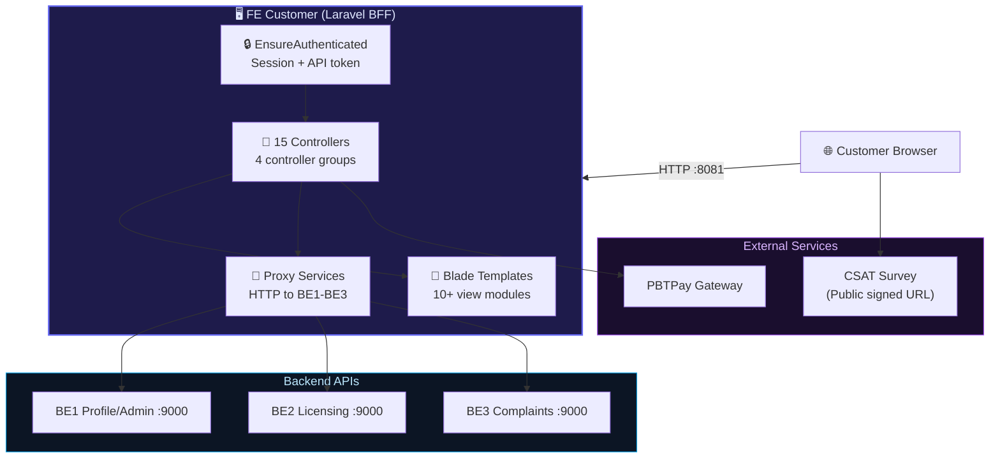
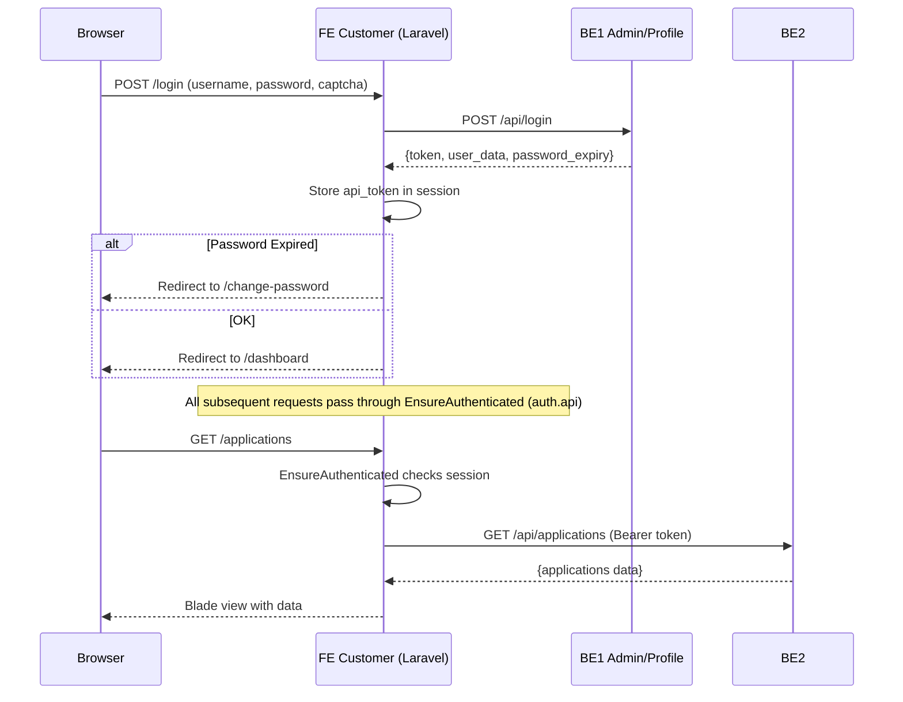
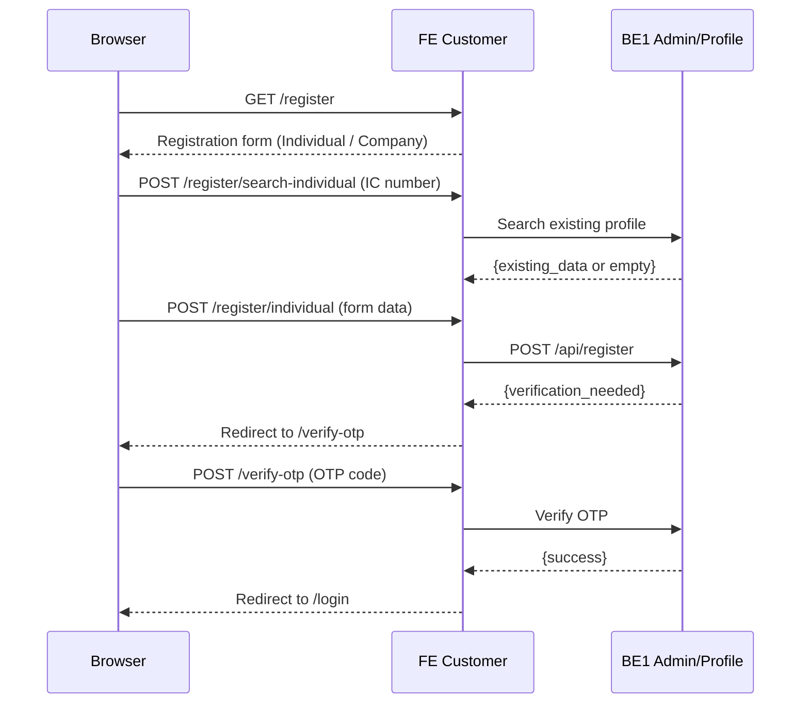

import { Tabs, Tab } from 'fumadocs-ui/components/tabs';

# FE Customer — Public Customer Portal (OSC-FE-CUSTOMER)

## 1. Overview

<div className="grid grid-cols-2 md:grid-cols-3 gap-3 my-6">
  <div className="bg-gradient-to-br from-blue-950 to-blue-900 border border-blue-700/50 rounded-lg p-4 text-center">
    <div className="text-3xl font-bold text-blue-300">15</div>
    <div className="text-xs text-blue-400 mt-1">Controllers</div>
  </div>
  <div className="bg-gradient-to-br from-emerald-950 to-emerald-900 border border-emerald-700/50 rounded-lg p-4 text-center">
    <div className="text-3xl font-bold text-emerald-300">4</div>
    <div className="text-xs text-emerald-400 mt-1">Proxy Services</div>
  </div>
  <div className="bg-gradient-to-br from-violet-950 to-violet-900 border border-violet-700/50 rounded-lg p-4 text-center">
    <div className="text-3xl font-bold text-violet-300">3</div>
    <div className="text-xs text-violet-400 mt-1">Backend Proxies (BE1-BE3)</div>
  </div>
  <div className="bg-gradient-to-br from-amber-950 to-amber-900 border border-amber-700/50 rounded-lg p-4 text-center">
    <div className="text-3xl font-bold text-amber-300">3</div>
    <div className="text-xs text-amber-400 mt-1">Custom Middleware</div>
  </div>
  <div className="bg-gradient-to-br from-rose-950 to-rose-900 border border-rose-700/50 rounded-lg p-4 text-center">
    <div className="text-3xl font-bold text-rose-300">10+</div>
    <div className="text-xs text-rose-400 mt-1">Blade View Modules</div>
  </div>
  <div className="bg-gradient-to-br from-cyan-950 to-cyan-900 border border-cyan-700/50 rounded-lg p-4 text-center">
    <div className="text-3xl font-bold text-cyan-300">2</div>
    <div className="text-xs text-cyan-400 mt-1">Languages (en/ms)</div>
  </div>
</div>

**Repository**: osc-fe-customer-main
**Name**: FE Customer — Public Customer Portal
**Purpose**: BFF (Backend-For-Frontend) for public users to apply for licenses, renew, cancel, file complaints, and manage profiles
**Framework**: Laravel 12 + Blade + Vue 3 + Alpine.js + Tailwind CSS 4
**Auth**: Session-based with API token in session (`EnsureAuthenticated` middleware alias `auth.api`)
**Docker Port**: 8081 (maps to container 80)
**Container Name**: `fe-public`
**Status**: Full customer portal — no local business database, all data from BE1-BE3 APIs

:::warning
**This is NOT a React/Next.js app.** FE Customer is a **Laravel Blade** application with **Alpine.js** for reactivity, **Vue 3** for interactive components, **Leaflet** for maps, **Select2/Tom-Select** for dropdowns, and **SweetAlert2** for modals. All business data comes from backend APIs.
:::

### Architecture Pattern



---

## 2. Tech Stack

<Tabs items={['PHP / Composer', 'Node / NPM', 'Docker', 'Frontend Libraries']}>
  <Tab value="PHP / Composer">

**Production**
| Package | Version | Purpose |
|---------|---------|---------|
| `php` | ^8.2 | Runtime |
| `laravel/framework` | ^12.0 | Framework |
| `laravel/tinker` | ^2.10.1 | REPL |
| `mews/captcha` | ^3.4 | Login CAPTCHA |

**Dev**
| Package | Version |
|---------|---------|
| `fakerphp/faker` | ^1.23 |
| `laravel/boost` | ^1.8 |
| `laravel/pail` | ^1.2.2 |
| `laravel/pint` | ^1.24 |
| `laravel/sail` | ^1.41 |
| `mockery/mockery` | ^1.6 |
| `nunomaduro/collision` | ^8.6 |
| `phpunit/phpunit` | ^11.5.3 |

:::info
Minimal PHP dependencies — no Sanctum, no DomPDF. Only `mews/captcha` beyond base Laravel. This is a pure BFF.
:::

  </Tab>
  <Tab value="Node / NPM">

**Production Dependencies**
| Package | Version | Purpose |
|---------|---------|---------|
| `alpinejs` | ^3.15.8 | Lightweight reactive JS |
| `@alpinejs/collapse` | ^3.15.8 | Alpine collapse plugin |
| `leaflet` | ^1.9.4 | Interactive maps |
| `select2` | ^4.1.0-rc.0 | Enhanced select dropdowns |
| `tom-select` | 2.3.1 | Tag input/select |
| `sweetalert2` | ^11.26.21 | Modal dialogs |
| `jquery` | ^3.7.1 | DOM manipulation |
| `@fontsource/poppins` | ^5.2.7 | Display font |
| `@fontsource/outfit` | ^5.2.8 | Sans-serif font |
| `@fontsource-variable/instrument-sans` | ^5.2.8 | Variable font |

**Dev Dependencies**
| Package | Version | Purpose |
|---------|---------|---------|
| `vue` | ^3.4.0 | UI framework |
| `@vitejs/plugin-vue` | ^5.0.0 | Vue Vite plugin |
| `tailwindcss` | ^4.0.0 | CSS framework |
| `@tailwindcss/vite` | ^4.0.0 | Tailwind Vite plugin |
| `axios` | ^1.11.0 | HTTP client |
| `vite` | ^6.0.0 | Build tool |
| `laravel-vite-plugin` | ^1.0.0 | Laravel integration |
| `concurrently` | ^9.0.1 | Parallel scripts |

  </Tab>
  <Tab value="Docker">

**docker-compose.yml**
- **Service**: `fe-public`
- **Port**: `8081:80`
- **Network**: `osc-network` (external)
- **Volume**: `./storage:/var/www/storage`
- **Health Check**: `curl -f http://localhost/health` (30s interval, 60s start period)

**Dockerfile** (3-stage build)
1. **Stage 1** (`node:20-alpine`): `npm ci` + `npm run build` — bundles all JS/CSS
2. **Stage 2** (`composer:2`): Install PHP production deps
3. **Stage 3** (`php:8.4-fpm-alpine`): Runtime with nginx + php-fpm via supervisor, PHP extensions: pdo_mysql, gd (freetype/jpeg), zip, bcmath, intl, opcache, pcntl, redis

**Key Environment Variables**:
```
APP_NAME=OSC FE Public
SESSION_DRIVER=file
CACHE_STORE=file
BE1_URL=http://be1-profile-admin:9000
BE2_URL=http://be2-licensing:9000
BE3_URL=http://be3-complaints-notif:9000
```

  </Tab>
  <Tab value="Frontend Libraries">

| Library | Purpose |
|---------|---------|
| Alpine.js 3 | Reactive DOM bindings for forms, toggles, menus |
| Vue 3 | Component-based interactivity |
| jQuery 3.7 | Legacy DOM manipulation |
| Leaflet | Interactive maps (location selection) |
| Select2 | Enhanced select dropdowns |
| Tom-Select | Tag inputs and autocomplete selects |
| SweetAlert2 | Modal confirmations/alerts |
| Tailwind CSS 4 | Utility-first CSS |
| Axios | HTTP client for AJAX requests |

  </Tab>
</Tabs>

---

## 3. Getting Started

```bash
# Docker (requires osc-network + BE1-BE3 running)
docker-compose up -d

# Local development
composer install
npm install
cp .env.example .env
php artisan key:generate
npm run dev   # Vite dev server
php artisan serve --port=8081
```

:::danger
**No local business database.** FE Customer has no custom migrations. All licensing, complaint, and profile data comes from BE1-BE3 via HTTP. Session and cache use `file` or `database` driver (SQLite by default locally).
:::

---

## 4. Authentication Flow



### Registration Flow



- **Login**: Proxied to BE1 with CAPTCHA validation
- **Middleware**: `EnsureAuthenticated` alias `auth.api` — checks `api_token` in session
- **Password Expiry**: `CheckPasswordExpiry` middleware validates from BE1 response
- **Language**: `SetLocale` middleware reads session locale (switchable via `/lang/{locale}`)
- **i18n**: Default locale `ms` (Malay), fallback `en`. `Accept-Language` header sent to all backend APIs.

---

## 5. Web Routes

### Public (No Auth)

<Tabs items={['Login & Registration', 'Password Reset', 'Public Endpoints']}>
  <Tab value="Login & Registration">

| Method | Path | Controller | Description |
|--------|------|-----------|-------------|
| GET | `/` | — | Login page (redirect if authenticated) |
| GET | `/login` | — | Redirect to `/` |
| POST | `/login` | AuthController@login | Authenticate (→ BE1) |
| POST | `/logout` | AuthController@logout | Logout |
| GET | `/register` | — | Registration form |
| POST | `/register/individual` | AuthController@registerIndividual | Register individual |
| POST | `/register/company` | AuthController@registerCompany | Register company |
| POST | `/register/search-individual` | AuthController@searchIndividual | Search by IC |
| POST | `/register/search-company` | AuthController@searchCompany | Search by SSM |
| GET | `/verify-otp` | AuthController@showVerifyOtp | OTP form |
| POST | `/verify-otp` | AuthController@verifyOtp | Verify OTP |
| POST | `/resend-otp` | AuthController@resendOtp | Resend OTP |

  </Tab>
  <Tab value="Password Reset">

| Method | Path | Controller | Description |
|--------|------|-----------|-------------|
| GET | `/forgot-password` | ForgotPasswordController@showLinkRequestForm | Form |
| POST | `/forgot-password` | ForgotPasswordController@sendResetLinkEmail | Send reset link |
| GET | `/reset-password/{token}` | ForgotPasswordController@showResetForm | Reset form |
| POST | `/reset-password` | ForgotPasswordController@reset | Execute reset |

  </Tab>
  <Tab value="Public Endpoints">

| Method | Path | Controller | Description |
|--------|------|-----------|-------------|
| GET | `/lang/{locale}` | — | Switch locale (en/ms) |
| GET | `/sample-page` | — | Sample UI reference |
| GET | `/complaints/{id}/csat/{token}` | ComplaintController@showCsat | CSAT survey (signed URL) |
| POST | `/complaints/{id}/csat/{token}` | ComplaintController@submitCsat | Submit CSAT |
| GET | `/public/complaints/download/...` | ComplaintController@publicDownload | Public file download |
| GET/POST | `/pbtpay/indirect` | PbtPayReturnController@indirect | PBTPay payment return |

  </Tab>
</Tabs>

### Protected (`auth.api` middleware)

<Tabs items={['Dashboard', 'License Applications', 'Renewals', 'Cancellations', 'Jana Sijil (Certificates)', 'Complaints', 'Profile & Company', 'Payments']}>
  <Tab value="Dashboard">

| Method | Path | Controller | Description |
|--------|------|-----------|-------------|
| GET | `/dashboard` | DashboardController@index | Main dashboard |
| GET | `/dashboard/applications` | DashboardController@applications | Application stats |
| GET | `/dashboard/renewals` | DashboardController@renewals | Renewal stats |
| GET | `/dashboard/transactions` | DashboardController@transactions | Transaction stats |

  </Tab>
  <Tab value="License Applications">

| Method | Path | Controller | Description |
|--------|------|-----------|-------------|
| GET | `/applications` | ApplicationController@index | List applications |
| GET | `/applications/list` | ApplicationController@list | Filtered list |
| GET | `/applications/create` | ApplicationController@create | New application form |
| POST | `/applications` | ApplicationController@store | Submit application |
| GET | `/applications/{id}` | ApplicationController@show | View details |
| GET | `/applications/{id}/edit` | ApplicationController@edit | Edit form |
| GET | `/applications/{id}/bill` | ApplicationController@bill | View bill |
| POST | `/applications/draft` | DraftController@store | Save draft |
| PUT | `/applications/draft/{id}` | DraftController@update | Update draft |
| DELETE | `/applications/draft/{id}` | DraftController@destroy | Delete draft |
| GET | `/applications/{id}/documents` | DocumentController@index | Document list |
| GET | `/applications/{id}/review` | ReviewController@show | View review |
| GET | `/applications/{id}/payment` | PaymentController@show | Payment info |
| POST | `/applications/{id}/payment` | PaymentController@store | Initiate payment |

  </Tab>
  <Tab value="Renewals">

| Method | Path | Controller | Description |
|--------|------|-----------|-------------|
| GET | `/renewal` | RenewalController@index | List renewals |
| GET | `/renewal/{licenseId}` | RenewalController@create | New renewal form |
| POST | `/renewal/{licenseId}` | RenewalController@store | Submit renewal |
| GET | `/renewal/{id}/edit` | RenewalController@edit | Edit renewal |
| PUT | `/renewal/draft/{id}` | RenewalController@updateDraft | Update renewal draft |

  </Tab>
  <Tab value="Cancellations">

| Method | Path | Controller | Description |
|--------|------|-----------|-------------|
| GET | `/cancellation` | CancellationController@index | Cancellation form |
| GET | `/cancellation/history` | CancellationController@history | Cancellation history |
| GET | `/cancellation/history/data` | CancellationController@historyData | History JSON |
| GET | `/cancellation/accounts/{customerId}` | CancellationController@getAccounts | Get accounts |
| POST | `/cancellation/license-info` | CancellationController@getLicenseInfo | License info |
| POST | `/cancellation/transaksi-lesen` | CancellationController@getTransaksiLesen | Transaction list |
| POST | `/cancellation/cancel` | CancellationController@cancelTransactions | Cancel transactions |
| POST | `/cancellation/cancel-account` | CancellationController@cancelAccount | Cancel account |
| POST | `/cancellation/close-user-account` | CancellationController@closeUserAccount | Close user account |

  </Tab>
  <Tab value="Jana Sijil (Certificates)">

| Method | Path | Controller | Description |
|--------|------|-----------|-------------|
| GET | `/jana-sijil` | JanaSijilController@index | License accounts list |
| GET | `/jana-sijil/create` | JanaSijilController@create | Create form |
| POST | `/jana-sijil` | JanaSijilController@store | Store |
| GET | `/jana-sijil/{id}` | JanaSijilController@show | View details |
| GET | `/jana-sijil/{idpbt}/cetak/{noakaun}` | JanaSijilController@cetakSijil | Print certificate |

  </Tab>
  <Tab value="Complaints">

| Method | Path | Controller | Description |
|--------|------|-----------|-------------|
| GET | `/complaints` | ComplaintController@index | List complaints |
| GET | `/complaints/create` | ComplaintController@create | New complaint form |
| POST | `/complaints` | ComplaintController@store | Submit complaint |
| GET | `/complaints/kategori` | ComplaintController@getKategori | Categories (AJAX) |
| GET | `/complaints/{id}` | ComplaintController@show | View complaint |
| GET | `/complaints/{id}/edit` | ComplaintController@edit | Edit complaint |
| PUT | `/complaints/{id}` | ComplaintController@update | Update complaint |
| GET | `/complaints/download/...` | ComplaintController@downloadAttachment | Download file |

  </Tab>
  <Tab value="Profile & Company">

| Method | Path | Controller | Description |
|--------|------|-----------|-------------|
| GET | `/profile` | ProfileController@show | View profile |
| PUT | `/profile` | ProfileController@update | Update profile |
| PUT | `/profile/password` | ProfileController@updatePassword | Change password |
| GET | `/company` | CompanyController@index | List companies |
| POST | `/company` | CompanyController@store | Add company |
| PUT | `/company/{id}` | CompanyController@update | Update company |
| DELETE | `/company/{id}` | CompanyController@destroy | Remove company |

  </Tab>
  <Tab value="Payments">

| Method | Path | Controller | Description |
|--------|------|-----------|-------------|
| GET | `/payments` | PaymentsController@index | Payment list |
| GET | `/payments/bills` | PaymentsController@bills | View bills |

  </Tab>
</Tabs>

---

## 6. Controllers

### Root Controllers

| Controller | Purpose |
|-----------|---------|
| **AuthController** | Login, logout, registration (individual/company), OTP verification |
| **DashboardController** | Dashboard with application/renewal/transaction stats |
| **ProfileController** | Profile show/update, password change |
| **CompanyController** | Company CRUD (add/edit/remove company profiles) |
| **ComplaintController** | Complaint CRUD, CSAT survey, file downloads |
| **PaymentsController** | Payment listing and bill viewing |
| **PbtPayReturnController** | PBTPay payment gateway callback handler |

### License Application Group (`LicenseApplication/`)

| Controller | Purpose |
|-----------|---------|
| **ApplicationController** | Application CRUD, list, create, show, edit, bill |
| **DraftController** | Draft save, update, delete |
| **DocumentController** | Document upload/listing per application |
| **ReviewController** | Application review display |
| **PaymentController** | Payment info and initiation |

### License Renewal Group (`LicenseRenewal/`)

| Controller | Purpose |
|-----------|---------|
| **RenewalController** | Renewal list, create per license, edit, draft update |

### License Cancellation Group (`LicenseCancellation/`)

| Controller | Purpose |
|-----------|---------|
| **CancellationController** | Full cancellation workflow: accounts, license info, cancel transactions, close account |

### Jana Sijil Group (`JanaSijil/`)

| Controller | Purpose |
|-----------|---------|
| **JanaSijilController** | License accounts listing, certificate printing (`cetakSijil`) |

### Auth Group (`Auth/`)

| Controller | Purpose |
|-----------|---------|
| **ForgotPasswordController** | Password reset workflow (send link, reset form, execute) |

---

## 7. Services (API Proxies)

| Service | Backend | Purpose |
|---------|---------|---------|
| **ComplaintService** | BE3 | Proxy for complaint CRUD, attachments, CSAT. Manages internal/external URL routing and token forwarding. |
| **LicenseApplicationService** | BE2 | Proxy for license applications — CRUD, documents, payments. Forwards HTTP requests with Bearer token and customer ID. |
| **LicenseRenewalService** | BE2 | Proxy for renewal-specific operations. |
| **LicenseCancellationService** | BE2 | Proxy for cancellation workflow — account lookup, transaction cancellation, account closure. |

### Backend URL Configuration

**`config/api.php`** (Two-tier API URLs):
```php
// Server-side (PHP → backend containers)
'be1_internal' => env('BE1_URL'),  // http://be1-profile-admin:9000
'be2_internal' => env('BE2_URL'),  // http://be2-licensing:9000
'be3_internal' => env('BE3_URL'),  // http://be3-complaints-notif:9000

// Client-side (JavaScript → external URLs)
'be1_external' => env('VITE_API_AUTH_URL'),
'be2_external' => env('VITE_API_LICENSING_URL'),
'be3_external' => env('VITE_API_COMPLAINT_URL'),
```

**`config/services.php`**:
```php
'api'     => ['profile_url' => env('API_PROFILE_URL')],
'be2'     => ['url' => rtrim(env('BE2_URL', 'http://be2.backend.svc.cluster.local/api'), '/')],
'report'  => ['url' => env('REPORT_SERVICE_URL', 'http://report-service.backend.svc.cluster.local:8080')],
'captcha' => [...],
```

:::info
**Two-tier URL pattern**: PHP controller code uses internal K8s DNS (e.g., `be2.backend.svc.cluster.local`), while client-side JavaScript uses external/public URLs via `VITE_API_*` environment variables exposed at build time.
:::

---

## 8. Middleware

| Middleware | Alias | Purpose |
|-----------|-------|---------|
| **EnsureAuthenticated** | `auth.api` | Checks `api_token` in session. Redirects to login (or returns 401 JSON for AJAX). Stores intended URL for redirect-after-login. |
| **CheckPasswordExpiry** | — | Validates password expiry flag from BE1 response. Redirects to password change if expired. |
| **SetLocale** | — | Sets application locale from session. Supports `en` and `ms`. |

---

## 9. Models

| Model | Purpose |
|-------|---------|
| **User** | Minimal Laravel user model for session management only. Fillable: `name`, `email`, `password`. No business data. |

:::info
**No custom domain models.** All business data (applications, licenses, complaints, profiles) lives in BE1-BE3 backends. FE Customer only has the default User model for session scaffolding.
:::

---

## 10. Blade View Structure

```
resources/views/
├── auth/
│   ├── register.blade.php
│   ├── forgot-password.blade.php
│   ├── reset-password.blade.php
│   └── verify-otp.blade.php
├── dashboard/
│   ├── dashboard.blade.php
│   └── partials/
├── license-application/
│   ├── index.blade.php
│   ├── create.blade.php
│   ├── show.blade.php
│   ├── bill.blade.php
│   ├── document/
│   ├── payment/
│   ├── review/
│   └── partials/
├── license-renewal/
│   ├── index.blade.php
│   └── create.blade.php
├── license-cancellation/
│   ├── index.blade.php
│   ├── history.blade.php
│   └── partials/
├── jana-sijil/
│   └── (certificate views)
├── complaints/
│   ├── index.blade.php
│   ├── create.blade.php
│   ├── show.blade.php
│   ├── edit.blade.php
│   ├── csat.blade.php          (Customer Satisfaction Survey)
│   └── success.blade.php
├── profile/
│   └── (profile management views)
├── payments/
│   └── (payment/bill views)
├── pbtpay/
│   └── (PBTPay gateway callback views)
├── layouts/
│   └── auth/ (guest, topbar, topnav)
├── components/
│   ├── content-wrapper.blade.php
│   ├── hero-bar.blade.php
│   ├── pagination.blade.php
│   ├── map-scripts.blade.php
│   ├── map-styles.blade.php
│   ├── guest-layout.blade.php
│   ├── form/
│   ├── table/
│   └── ui/
├── partials/
│   └── (shared partials)
└── welcome.blade.php
```

---

## 11. Directory Structure

```
app/
├── Http/
│   ├── Controllers/
│   │   ├── Auth/
│   │   │   └── ForgotPasswordController.php
│   │   ├── LicenseApplication/
│   │   │   ├── ApplicationController.php
│   │   │   ├── DocumentController.php
│   │   │   ├── DraftController.php
│   │   │   ├── PaymentController.php
│   │   │   └── ReviewController.php
│   │   ├── LicenseRenewal/
│   │   │   └── RenewalController.php
│   │   ├── LicenseCancellation/
│   │   │   └── CancellationController.php
│   │   ├── JanaSijil/
│   │   │   └── JanaSijilController.php
│   │   ├── AuthController.php
│   │   ├── CompanyController.php
│   │   ├── ComplaintController.php
│   │   ├── Controller.php
│   │   ├── DashboardController.php
│   │   ├── PaymentsController.php
│   │   ├── PbtPayReturnController.php
│   │   └── ProfileController.php
│   └── Middleware/
│       ├── CheckPasswordExpiry.php
│       ├── EnsureAuthenticated.php
│       └── SetLocale.php
├── Models/
│   └── User.php
├── Providers/
│   └── AppServiceProvider.php   (adds Accept-Language header to all HTTP requests)
├── Services/
│   ├── LicenseApplication/
│   │   └── LicenseApplicationService.php
│   ├── LicenseRenewal/
│   │   └── LicenseRenewalService.php
│   ├── LicenseCancellation/
│   │   └── LicenseCancellationService.php
│   └── ComplaintService.php
└── (No Traits, Enums, Helpers, Events, Jobs, Commands, Mail, Exports)
```

---

## 12. Key Features

### Customer-Facing Capabilities

| Feature | Backend | Description |
|---------|---------|-------------|
| **Registration** | BE1 | Individual and company registration with OTP verification |
| **License Application** | BE2 | Full lifecycle: create → draft → submit → review → payment → bill |
| **License Renewal** | BE2 | Renew existing licenses with draft support |
| **License Cancellation** | BE2 | Cancel transactions, accounts, or close user accounts entirely |
| **Certificate Printing** | BE2 | Jana Sijil: view accounts and print license certificates |
| **Complaints** | BE3 | Submit, track, edit complaints with CSAT survey on resolution |
| **Profile Management** | BE1 | View/edit profile, change password |
| **Company Management** | BE1 | Multiple company profiles per user |
| **Payments** | BE2/PBTPay | View bills, initiate payment, PBTPay gateway callback |
| **Maps** | — | Leaflet for location selection in complaints/applications |
| **CAPTCHA** | — | `mews/captcha` on login for anti-bot protection |
| **i18n** | — | English/Malay language switching via `/lang/{locale}` |
